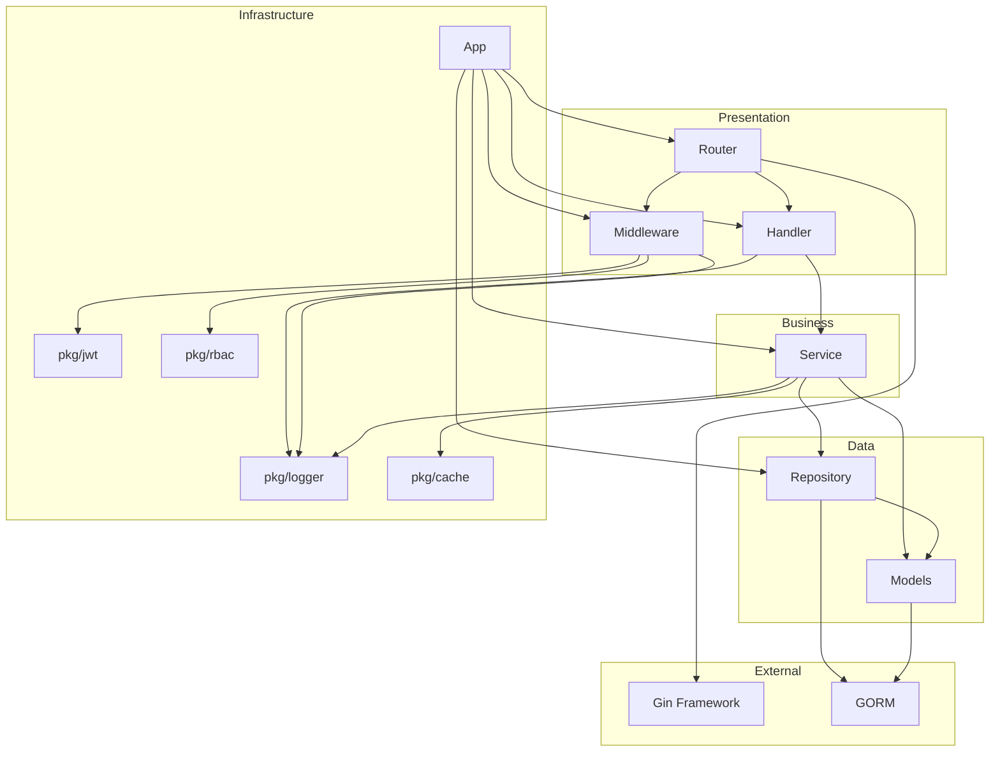

# 依赖关系索引

## 依赖关系说明

箭头表示依赖方向：**A → B** 表示 A 依赖 B

## 模块依赖关系

### Presentation 层

#### handler → service, logger

- **handler** 调用 **service** 处理业务逻辑
- **handler** 使用 **logger** 记录日志

#### middleware → jwt, rbac, logger

- **middleware** 使用 **jwt** 进行认证
- **middleware** 使用 **rbac** 进行鉴权
- **middleware** 使用 **logger** 记录日志

#### router → handler, middleware

- **router** 注册 **handler**
- **router** 注册 **middleware**

---

### Business 层

#### service → repository, models, cache, logger

- **service** 调用 **repository** 访问数据
- **service** 使用 **models** 定义的数据结构
- **service** 使用 **cache** 进行缓存
- **service** 使用 **logger** 记录日志

---

### Data 层

#### repository → models, gorm

- **repository** 操作 **models** 定义的数据模型
- **repository** 使用 **GORM** 进行数据库操作

#### models → gorm

- **models** 使用 **GORM** 标签定义表结构

---

### Infrastructure 层

#### app → 所有模块

- **app** 初始化并组装所有组件
- **app** 管理组件的生命周期

---

## 依赖流程图

---

## 第三方依赖清单

### Web 框架

**Gin**

- 包名：`github.com/gin-gonic/gin`
- 版本：`v1.9.1`
- 用途：HTTP Web 框架
- 使用模块：
  - `internal/router`
  - `internal/handler`
  - `internal/middleware`
  - `pkg/httpserver`

---

### ORM 框架

**GORM**

- 包名：`gorm.io/gorm`
- 版本：`v1.25.5`
- 用途：ORM 框架，数据库操作
- 使用模块：
  - `internal/repository`
  - `internal/models`

**GORM Drivers**

- MySQL: `gorm.io/driver/mysql`
- PostgreSQL: `gorm.io/driver/postgres`

---

### 日志框架

**Zap**

- 包名：`go.uber.org/zap`
- 用途：高性能日志框架
- 使用模块：
  - `pkg/logger`

---

### 缓存

**go-redis**

- 包名：`github.com/redis/go-redis/v9`
- 用途：Redis 客户端
- 使用模块：
  - `pkg/cache`

---

### JWT 认证

**jwt-go**

- 包名：`github.com/golang-jwt/jwt/v5`
- 用途：JWT 令牌生成和验证
- 使用模块：
  - `pkg/jwt`

---

### RBAC 权限

**Casbin**

- 包名：`github.com/casbin/casbin/v2`
- 用途：访问控制库（RBAC）
- 使用模块：
  - `pkg/rbac`

**Casbin GORM Adapter**

- 包名：`github.com/casbin/gorm-adapter/v3`
- 用途：Casbin 的 GORM 适配器
- 使用模块：
  - `pkg/rbac`

---

### 协程池

**Ants**

- 包名：`github.com/panjf2000/ants/v2`
- 用途：高性能协程池
- 使用模块：
  - `pkg/executor`

---

## 依赖规则

### 规则 1：单向依赖

**上层依赖下层，禁止反向依赖**

✅ 正确：Handler → Service → Repository  
❌ 错误：Repository → Service

### 规则 2：同层不依赖

**同一层的模块不应相互依赖**

✅ 正确：Handler 独立，Service 独立  
❌ 错误：UserHandler → AuthHandler

### 规则 3：pkg 独立

**pkg/ 下的包应独立，不依赖 internal/**

✅ 正确：pkg/logger 独立  
❌ 错误：pkg/logger → internal/service

### 规则 4：接口隔离

**使用接口解耦，避免直接依赖具体实现**

✅ 正确：Handler 依赖 ServiceInterface  
❌ 错误：Handler 依赖 ServiceStruct

---

## 循环依赖检查

**状态**：✅ 无循环依赖

**说明**：项目采用分层架构，严格遵循依赖方向，不存在循环依赖。

---

## 快速查询

### 某个模块依赖了什么？

| 模块       | 依赖                              |
| ---------- | --------------------------------- |
| handler    | service, logger                   |
| service    | repository, models, cache, logger |
| repository | models, gorm                      |
| middleware | jwt, rbac, logger                 |
| router     | handler, middleware, gin          |

### 某个模块被谁依赖？

| 模块       | 被依赖                       |
| ---------- | ---------------------------- |
| service    | handler                      |
| repository | service                      |
| models     | service, repository          |
| logger     | handler, service, middleware |
| cache      | service                      |
