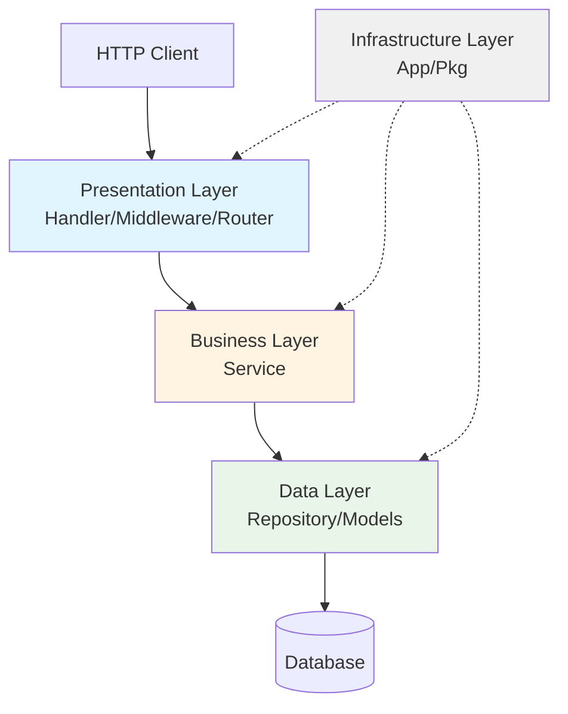

# 分层架构索引

## 架构模式

**Clean Architecture**（整洁架构）变体

## 架构层级

### Level 1: Presentation Layer（表现层）

**别名**：表现层、展示层

**职责**：

- 接收和验证 HTTP 请求
- 参数绑定和校验
- 调用 Business 层处理业务
- 格式化并返回响应
- 错误处理和响应封装

**目录**：

- `internal/handler`
- `internal/middleware`
- `internal/router`

**开发模式**：

- RESTful API 设计
- 统一响应格式
- 中间件链

**依赖**：

- Business Layer
- pkg/logger

**示例文件**：

- `internal/handler/user.go`
- `internal/middleware/auth.go`
- `internal/router/router.go`

**应该做什么**：

- ✅ HTTP 请求处理
- ✅ 参数验证
- ✅ 响应格式化

**不应该做什么**：

- ❌ 业务逻辑
- ❌ 直接数据库操作
- ❌ 复杂数据处理

---

### Level 2: Business Layer（业务层）

**别名**：业务逻辑层、服务层

**职责**：

- 实现业务逻辑
- 业务规则验证
- 事务管理
- 数据转换
- 调用 Data 层访问数据

**目录**：

- `internal/service`

**开发模式**：

- 服务接口定义

（`interface.go`）

- 依赖注入
- 事务边界

**依赖**：

- Data Layer
- pkg/cache
- pkg/logger

**示例文件**：

- `internal/service/user/user_service.go`
- `internal/service/auth/auth_service.go`

**应该做什么**：

- ✅ 业务规则实现
- ✅ 事务管理
- ✅ 数据转换

**不应该做什么**：

- ❌ HTTP 相关处理
- ❌ 直接数据库操作

---

### Level 3: Data Layer（数据层）

**别名**：数据访问层、持久化层

**职责**：

- 数据库 CRUD 操作
- 复杂查询封装
- 数据模型定义
- 数据访问抽象

**目录**：

- `internal/repository`
- `internal/models`

**开发模式**：

- Repository 模式
- GORM 模型
- 查询构建器

**依赖**：

- gorm.io/gorm

**示例文件**：

- `internal/repository/user_repository.go`
- `internal/models/user.go`

**应该做什么**：

- ✅ 数据访问
- ✅ 查询构建
- ✅ 模型定义

**不应该做什么**：

- ❌ 业务逻辑
- ❌ HTTP 处理

---

### Level 0: Infrastructure Layer（基础设施层）

**别名**：基础设施层、工具层

**职责**：

- 应用初始化
- 组件组装
- 依赖注入
- 配置管理
- 公共工具

**目录**：

- `internal/app`
- `pkg/`
- `cmd/`

**开发模式**：

- 工厂模式
- 单例模式
- 依赖注入

**依赖**：所有层

**示例文件**：

- `internal/app/app.go`
- `pkg/logger/logger.go`
- `cmd/server/main.go`

**应该做什么**：

- ✅ 组件初始化
- ✅ 工具封装
- ✅ 配置管理

**不应该做什么**：

- ❌ 业务逻辑
- ❌ 请求处理

---

## 层间通信规则

### 规则 1：单向依赖

**只能上层依赖下层，禁止反向依赖**

✅ 正确：`Handler → Service → Repository`  
❌ 错误：`Repository → Service`

### 规则 2：接口隔离

**使用接口解耦层间依赖**

示例：Service 定义 Repository 接口，Repository 实现接口

```go
// Business 层定义接口
type UserRepository interface {
    FindByID(id uint) (*models.User, error)
}

// Data 层实现接口
type userRepository struct {
    db *gorm.DB
}

func (r *userRepository) FindByID(id uint) (*models.User, error) {
    // 实现...
}
```

### 规则 3：DTO 转换

**层间数据传输使用 DTO，避免直接传递领域模型**

- Handler 使用请求/响应 DTO
- Service 使用领域模型
- Repository 使用数据模型

### 规则 4：错误传播

**下层错误向上层传播，上层统一处理**

```
Repository 错误 → Service 包装 → Handler 格式化
```

---

## 文件分布详情

### Presentation Layer

#### Handler

**模式**：`*.go`  
**命名**：`{entity}.go` 或 `{entity}_handler.go`  
**示例**：`user.go`, `auth.go`

#### Middleware

**模式**：`*.go`  
**命名**：`{功能}.go` 或 `{功能}_middleware.go`  
**示例**：`auth.go`, `logger.go`

#### Router

**文件**：

- `router.go` - 路由注册

---

### Business Layer

#### Service

**结构**：按模块组织子目录

**文件**：

- `interface.go` - 服务接口定义
- `*_service.go` - 服务实现

**示例**：

```
service/
├── user/
│   ├── interface.go
│   └── user_service.go
└── auth/
    ├── interface.go
    └── auth_service.go
```

---

### Data Layer

#### Repository

**模式**：`*_repository.go`  
**命名**：`{entity}_repository.go`  
**示例**：`user_repository.go`

#### Models

**模式**：`*.go`  
**命名**：`{entity}.go`  
**示例**：`user.go`, `role.go`

---

### Infrastructure Layer

#### App

**文件**：

- `app.go` - 应用主结构
- `app_business.go` - 业务组件初始化
- `app_infrastructure.go` - 基础设施初始化

#### Pkg

**结构**：每个工具包独立目录

**必需文件**：

- `{pkg}.go` - 主实现
- `doc.go` - 包文档
- `README.md` - 使用说明

---

## 架构图示



---

## 职责边界

### 什么时候在哪一层开发？

| 场景          | 层级           | 理由           |
| ------------- | -------------- | -------------- |
| 新增 API 接口 | Presentation   | 处理 HTTP 请求 |
| 实现业务规则  | Business       | 业务逻辑处理   |
| 数据库查询    | Data           | 数据访问       |
| 工具封装      | Infrastructure | 可复用组件     |
| 请求验证      | Presentation   | 参数校验       |
| 事务管理      | Business       | 业务事务       |
| 数据模型定义  | Data           | 表结构映射     |

---

## 最佳实践

### 实践 1：薄 Handler 厚 Service

**Handler 只做参数验证和响应，业务逻辑放 Service**

✅ 正确：

```go
func (h *UserHandler) GetUser(c *gin.Context) {
    id := c.Param("id")
    user, err := h.userService.GetByID(id) // 调用 Service
    if err != nil {
        c.JSON(500, err)
        return
    }
    c.JSON(200, user)
}
```

❌ 错误：

```go
func (h *UserHandler) GetUser(c *gin.Context) {
    // 在 Handler 中写业务逻辑
    user := h.db.First(&User{}, id)
    if user.Age < 18 {
        // 业务规则不应在这里
    }
}
```

### 实践 2：Repository 只做数据访问

**Repository 不包含业务逻辑，只封装数据操作**

✅ 正确：

```go
func (r *userRepository) FindByID(id uint) (*models.User, error) {
    var user models.User
    err := r.db.First(&user, id).Error
    return &user, err
}
```

❌ 错误：

```go
func (r *userRepository) FindAdultUsers() ([]*models.User, error) {
    // 业务规则（年龄>=18）不应在 Repository
    return r.db.Where("age >= ?", 18).Find(&users).Error
}
```

### 实践 3：使用接口解耦

**各层通过接口通信，便于测试和替换实现**

✅ 正确：

```go
type UserService interface {
    GetByID(id uint) (*models.User, error)
}

type UserHandler struct {
    userService UserService // 依赖接口
}
```

### 实践 4：统一错误处理

**定义错误码和错误类型，统一处理和响应**

参见 [error-handling skill](file:///d:/coder/go/go-scaffold/main/go-scaffold/.agent/skills/error-handling/SKILL.md)
