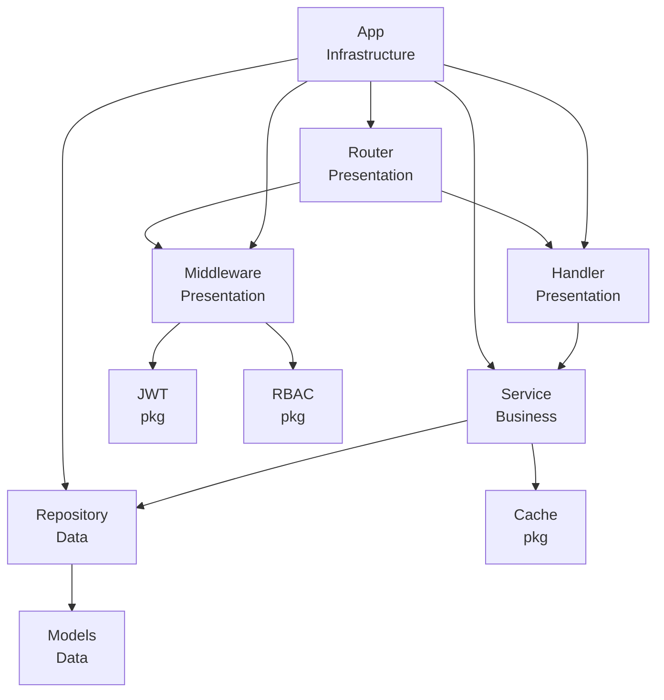

# 模块划分索引

## 核心业务模块

### handler - HTTP 处理器

**路径**：`internal/handler`  
**层级**：Presentation  
**职责**：HTTP 请求处理，参数验证，响应封装

**依赖**：

- `internal/service` - 调用业务逻辑
- `pkg/logger` - 日志记录

**入口文件**：

- `user.go` - 用户相关接口处理
- `auth.go` - 认证相关接口处理
- `rbac.go` - 权限管理接口处理

**开发模式**：

1. 接收 HTTP 请求
2. 参数验证和绑定
3. 调用 Service 层处理业务
4. 格式化并返回标准响应

---

### service - 业务逻辑层

**路径**：`internal/service`  
**层级**：Business  
**职责**：业务逻辑处理，事务管理，业务规则实现

**依赖**：

- `internal/repository` - 数据访问
- `internal/models` - 数据模型
- `pkg/cache` - 缓存操作
- `pkg/logger` - 日志记录

**子模块**：

- `user/` - 用户业务逻辑
- `auth/` - 认证业务逻辑

**文件组织**：

```
service/
├── user/
│   ├── interface.go       # UserService 接口定义
│   └── user_service.go    # 服务实现
└── auth/
    ├── interface.go       # AuthService 接口定义
    └── auth_service.go    # 服务实现
```

**开发模式**：

1. 定义服务接口（`interface.go`）
2. 实现业务逻辑
3. 管理事务边界
4. 调用 Repository 层访问数据

---

### repository - 数据访问层

**路径**：`internal/repository`  
**层级**：Data  
**职责**：数据持久化，数据库操作，数据访问抽象

**依赖**：

- `internal/models` - 数据模型
- `gorm.io/gorm` - ORM 框架

**入口文件**：

- `user_repository.go` - 用户数据访问
- `auth_repository.go` - 认证数据访问
- `rbac_repository.go` - 权限数据访问

**开发模式**：

1. 定义 Repository 接口
2. 实现 CRUD 操作
3. 封装复杂查询
4. 提供数据访问抽象

---

### models - 数据模型

**路径**：`internal/models`  
**层级**：Data  
**职责**：数据模型定义，表结构映射

**依赖**：无（或仅依赖 GORM）

**入口文件**：

- `user.go` - 用户模型
- `role.go` - 角色模型

**开发模式**：

1. 定义 GORM 模型结构体
2. 添加表关联（HasMany, BelongsTo 等）
3. 实现模型方法（如 TableName()）

---

### middleware - Gin 中间件

**路径**：`internal/middleware`  
**层级**：Presentation  
**职责**：请求拦截，认证授权，日志记录

**依赖**：

- `pkg/jwt` - JWT 认证
- `pkg/rbac` - RBAC 权限
- `pkg/logger` - 日志记录

**入口文件**：

- `auth.go` - JWT 认证中间件
- `rbac.go` - RBAC 权限控制
- `logger.go` - 请求日志

**开发模式**：

1. 实现 `gin.HandlerFunc` 函数
2. 处理请求拦截逻辑
3. 返回中间件函数

---

### router - 路由配置

**路径**：`internal/router`  
**层级**：Presentation  
**职责**：路由配置，中间件注册

**依赖**：

- `internal/handler` - HTTP 处理器
- `internal/middleware` - 中间件
- `github.com/gin-gonic/gin` - Web 框架

**入口文件**：

- `router.go` - 路由注册

**开发模式**：

1. 创建路由组
2. 注册中间件
3. 绑定 Handler 到路由

---

### app - 应用核心

**路径**：`internal/app`  
**层级**：Infrastructure  
**职责**：应用初始化，依赖注入，组件组装

**依赖**：所有模块

**入口文件**：

- `app.go` - 应用主结构
- `app_business.go` - 业务组件初始化
- `app_infrastructure.go` - 基础设施初始化

**开发模式**：

1. 初始化所有组件
2. 管理组件生命周期
3. 依赖注入

---

## 工具包模块（pkg/）

### logger - 日志工具

**路径**：`pkg/logger`  
**职责**：日志记录，日志级别管理  
**外部依赖**：`go.uber.org/zap`

---

### cache - 缓存工具

**路径**：`pkg/cache`  
**职责**：缓存操作抽象  
**外部依赖**：`github.com/redis/go-redis/v9`

---

### jwt - JWT 认证

**路径**：`pkg/jwt`  
**职责**：JWT 生成和验证  
**外部依赖**：`github.com/golang-jwt/jwt/v5`

---

### rbac - RBAC 权限

**路径**：`pkg/rbac`  
**职责**：RBAC 权限控制  
**外部依赖**：

- `github.com/casbin/casbin/v2`
- `github.com/casbin/gorm-adapter/v3`

---

### httpserver - HTTP 服务器封装

**路径**：`pkg/httpserver`  
**职责**：HTTP 服务器生命周期管理  
**外部依赖**：`github.com/gin-gonic/gin`

---

### executor - 协程池

**路径**：`pkg/executor`  
**职责**：协程池管理  
**外部依赖**：`github.com/panjf2000/ants/v2`

---

## 模块关系图



---

## 快速查找

### 按层级查找

| 层级               | 模块                        |
| ------------------ | --------------------------- |
| **Presentation**   | handler, middleware, router |
| **Business**       | service                     |
| **Data**           | repository, models          |
| **Infrastructure** | app, pkg/\*                 |

### 按职责查找

| 我想要...      | 查看模块   |
| -------------- | ---------- |
| 处理 HTTP 请求 | handler    |
| 实现业务逻辑   | service    |
| 访问数据库     | repository |
| 定义数据模型   | models     |
| 添加中间件     | middleware |
| 配置路由       | router     |
| 初始化应用     | app        |
| 使用工具       | pkg/\*     |
