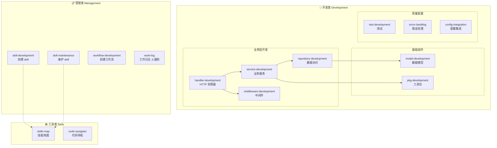

# Skills 地图

## 概述

本文档提供项目所有 skills 的全景视图，帮助快速了解、定位和选择所需的 skill。

> [!IMPORTANT]
> **维护规则**
>
> 每次有 skills 的新增、修改或删除时，都必须更新本地图以保持同步。

## Skills 分类体系

根据用途，本项目的 skills 分为三大类：

### 🔧 开发类 (Development)

用于实际代码开发的 skills，涵盖各层级和组件的开发指南。

### 📋 管理类 (Management)

用于项目管理和维护的 skills，包括 skill 本身的管理和工作流。

### 🛠️ 工具类 (Tools)

辅助工具和导航 skills，用于提升开发效率。

## Skills 全景图

## Skills 清单

### 🔧 开发类 (Development)

#### 业务层开发

| Skill 名称                                                                                                                   | 用途                 | 适用场景                      | 关联层级     |
| ---------------------------------------------------------------------------------------------------------------------------- | -------------------- | ----------------------------- | ------------ |
| **[handler-development](file:///d:/coder/go/go-scaffold/main/go-scaffold/.agent/skills/handler-development/SKILL.md)**       | 创建 HTTP 请求处理器 | 新增 API 接口、处理 HTTP 请求 | Presentation |
| **[service-development](file:///d:/coder/go/go-scaffold/main/go-scaffold/.agent/skills/service-development/SKILL.md)**       | 创建业务逻辑服务     | 实现业务逻辑、数据处理        | Business     |
| **[repository-development](file:///d:/coder/go/go-scaffold/main/go-scaffold/.agent/skills/repository-development/SKILL.md)** | 创建数据访问层       | 数据库操作、数据持久化        | Data         |
| **[middleware-development](file:///d:/coder/go/go-scaffold/main/go-scaffold/.agent/skills/middleware-development/SKILL.md)** | 创建 Gin 中间件      | 请求拦截、日志、认证等        | Presentation |

#### 基础组件

| Skill 名称                                                                                                         | 用途             | 适用场景                   |
| ------------------------------------------------------------------------------------------------------------------ | ---------------- | -------------------------- |
| **[model-development](file:///d:/coder/go/go-scaffold/main/go-scaffold/.agent/skills/model-development/SKILL.md)** | 创建数据模型     | 定义数据结构、表映射       |
| **[pkg-development](file:///d:/coder/go/go-scaffold/main/go-scaffold/.agent/skills/pkg-development/SKILL.md)**     | 创建可复用工具包 | 开发通用工具、封装第三方库 |

#### 质量与配置

| Skill 名称                                                                                                           | 用途         | 适用场景                 |
| -------------------------------------------------------------------------------------------------------------------- | ------------ | ------------------------ |
| **[test-development](file:///d:/coder/go/go-scaffold/main/go-scaffold/.agent/skills/test-development/SKILL.md)**     | 编写测试     | 单元测试、集成测试       |
| **[error-handling](file:///d:/coder/go/go-scaffold/main/go-scaffold/.agent/skills/error-handling/SKILL.md)**         | 错误处理规范 | 统一错误处理、错误码定义 |
| **[config-integration](file:///d:/coder/go/go-scaffold/main/go-scaffold/.agent/skills/config-integration/SKILL.md)** | 配置集成     | 应用配置集成流程         |

---

### 📋 管理类 (Management)

| Skill 名称                                                                                                               | 用途            | 适用场景                      | 强制性      |
| ------------------------------------------------------------------------------------------------------------------------ | --------------- | ----------------------------- | ----------- |
| **[skill-development](file:///d:/coder/go/go-scaffold/main/go-scaffold/.agent/skills/skill-development/SKILL.md)**       | 创建新 skill    | 识别场景并创建新的 skill 文件 | 可选        |
| **[skill-maintenance](file:///d:/coder/go/go-scaffold/main/go-scaffold/.agent/skills/skill-maintenance/SKILL.md)**       | 维护现有 skills | 更新、优化、变更现有 skills   | 可选        |
| **[workflow-development](file:///d:/coder/go/go-scaffold/main/go-scaffold/.agent/skills/workflow-development/SKILL.md)** | 创建工作流      | 定义可复用的工作流程          | 可选        |
| **[work-log](file:///d:/coder/go/go-scaffold/main/go-scaffold/.agent/skills/work-log/SKILL.md)**                         | 工作日志记录    | 每次任务完成后记录工作日志    | ⚠️ **强制** |

---

### 🛠️ 工具类 (Tools)

| Skill 名称                                                                                                   | 用途         | 适用场景                            |
| ------------------------------------------------------------------------------------------------------------ | ------------ | ----------------------------------- |
| **[skills-map](file:///d:/coder/go/go-scaffold/main/go-scaffold/.agent/skills/skills-map/SKILL.md)**         | Skills 地图  | 快速了解和定位所有 skills（本文档） |
| **[code-navigator](file:///d:/coder/go/go-scaffold/main/go-scaffold/.agent/skills/code-navigator/SKILL.md)** | 代码导航系统 | 项目结构索引、模块定位              |

## 快速索引

### 按开发场景查找

| 我想要...      | 使用这个 Skill                                                     |
| -------------- | ------------------------------------------------------------------ |
| 新增 API 接口  | handler-development → service-development → repository-development |
| 创建数据模型   | model-development                                                  |
| 添加中间件     | middleware-development                                             |
| 开发可复用工具 | pkg-development                                                    |
| 编写测试       | test-development                                                   |
| 集成配置       | config-integration                                                 |
| 处理错误       | error-handling                                                     |
| 创建新 skill   | skill-development                                                  |
| 更新 skill     | skill-maintenance                                                  |
| 记录工作       | work-log（强制）                                                   |
| 了解项目结构   | code-navigator                                                     |

### 按层级查找

| 架构层级              | 相关 Skills                                 |
| --------------------- | ------------------------------------------- |
| **Presentation 层**   | handler-development, middleware-development |
| **Business 层**       | service-development                         |
| **Data 层**           | repository-development, model-development   |
| **Infrastructure 层** | pkg-development, config-integration         |

## Skills 统计

- **总计**：13 个 skills
- **开发类**：9 个
- **管理类**：4 个
- **工具类**：2 个

## 变更历史

### 2026-01-19

- ✅ 新增 `skills-map` - Skills 地图
- ✅ 新增 `code-navigator` - 代码导航系统
- ✅ 重构 `work-log`（原 `changelog-recording`）- 工作日志记录

### 2026-01-15 至 2026-01-19

- ✅ 新增 `skill-development` - 创建新 skill
- ✅ 新增 `skill-maintenance` - 维护 skills
- ✅ 新增 `test-development` - 测试开发
- ✅ 新增 `workflow-development` - 工作流开发
- ✅ 新增 `error-handling` - 错误处理规范

## 维护指南

### 何时更新本地图

**必须更新**：

- ✅ 新增任何 skill
- ✅ 删除任何 skill
- ✅ Skill 名称变更
- ✅ Skill 用途重大变更

**建议更新**：

- 📝 Skill 描述优化
- 📝 分类调整
- 📝 定期审查（每月）

### 更新步骤

1. **更新全景图**：修改 mermaid 图表
2. **更新清单表格**：添加/删除/修改对应条目
3. **更新统计信息**：更新 skills 数量
4. **记录变更历史**：在变更历史中添加条目
5. **更新时间戳**：更新最后更新日期

### 添加新 Skill 模板

使用 [templates/skill-entry.md](file:///d:/coder/go/go-scaffold/main/go-scaffold/.agent/skills/skills-map/templates/skill-entry.md) 快速添加新 skill 条目。

## 使用建议

### 新开发者

1. 先阅读本地图，了解项目的 skills 体系
2. 查看 `code-navigator` 了解项目结构
3. 根据需要选择对应的 development skill

### 日常开发

1. 根据开发任务查找对应的 skill
2. 参考 skill 文档进行开发
3. 完成后使用 `work-log` 记录工作

### Skills 维护

1. 创建新 skill 后立即更新本地图
2. 定期审查并优化 skills 体系
3. 及时清理过时的 skills

---

**最后更新**：2026-01-19  
**Skills 总数**：13
