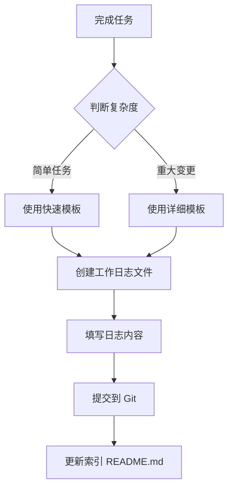

# 工作日志记录规范

## 核心理念

> [!IMPORTANT]
> **这是一个强制执行的 Skill**
>
> 每次完成任务后，无论大小，都必须记录工作日志。这不仅是为了项目管理，更是为了：
>
> - 积累开发经验和思路
> - 记录问题解决方案
> - 追溯历史决策
> - 方便团队协作

## 适用场景

### 必须记录的情况（每次都要）

- ✅ 完成任何功能开发（无论大小）
- ✅ 修复 bug 或问题
- ✅ 进行代码重构
- ✅ 更新配置或依赖
- ✅ 编写或更新文档
- ✅ 创建或修改 skill/workflow
- ✅ **任何有意义的代码或文档变更**

### 特殊说明

即使是很小的改动（如修改一行配置、添加一个注释），只要你认为值得记录，就应该记录。**宁可多记录，不要漏记录**。

## 文件结构

```
docs/
└── worklogs/
    ├── 2026/
    │   ├── 01/
    │   │   ├── 19_refactor_work_log_system.md
    │   │   ├── 19_optimize_rbac_middleware.md
    │   │   ├── 20_fix_cache_concurrency.md
    │   │   └── ...
    │   ├── 02/
    │   │   └── ...
    │   └── ...
    └── README.md
```

## 文件命名规范

### 格式

```
DD_task_description.md
```

### 组成部分

1. **日期部分** (`DD`)
   - 2位日期
   - 示例：`19`（19日）
   - **年月通过目录结构体现**（`YYYY/MM/`）

2. **描述部分** (`task_description`)
   - 使用英文单词，用下划线分隔
   - 简洁清晰，不超过3-4个单词
   - 使用动词+名词的形式
   - 示例：`refactor_work_log`、`fix_cache_issue`、`add_user_auth`

### 命名示例

```bash
# 好的命名
19_refactor_work_log_system.md
20_implement_user_authentication.md
21_optimize_database_query.md
15_fix_token_expiration.md
18_add_rbac_middleware.md

# 避免的命名
2026-01-19_update.md      # 不需要完整日期
update-code.md            # 缺少日期部分
19_work.md                # 描述不清晰
19-refactor.md            # 应使用下划线而非短横线
```

## 双模板系统

根据任务复杂度选择合适的模板：

### 快速模板（推荐日常使用）

**使用场景**：

- 日常小任务
- 简单的功能实现
- bug 修复
- 配置更新
- **80%的日常工作**

**记录时间**：2-3分钟

**模板路径**：[templates/quick.md](file:///d:/coder/go/go-scaffold/main/go-scaffold/.agent/skills/work-log/templates/quick.md)

### 详细模板（重大变更使用）

**使用场景**：

- 架构级变更
- 新模块开发
- 重大重构
- 复杂功能实现
- **需要详细记录的20%工作**

**记录时间**：10-15分钟

**模板路径**：[templates/detailed.md](file:///d:/coder/go/go-scaffold/main/go-scaffold/.agent/skills/work-log/templates/detailed.md)

## 记录流程

### 标准流程



### 详细步骤

#### 1. 确定目录结构

```bash
# 确保目录存在
# PowerShell
$year = (Get-Date).Year
$month = (Get-Date).ToString("MM")
$targetDir = "docs/worklogs/$year/$month"
New-Item -ItemType Directory -Path $targetDir -Force
```

#### 2. 创建工作日志文件

```bash
# 生成文件名
$day = (Get-Date).ToString("dd")
$description = "task_description"  # 替换为实际描述（英文）
$filename = "$targetDir/${day}_${description}.md"

# 示例
# docs/worklogs/2026/01/19_refactor_work_log_system.md
```

#### 3. 选择并填充模板

**快速模板示例**：

```markdown
# 重构工作日志系统

## 任务概述

将原有的 changelog-recording 重构为强制执行的工作日志系统。

## 完成内容

- 重命名文件夹：`changelog-recording` → `work-log`
- 重写 SKILL.md，明确强制执行规则
- 创建快速和详细两种记录模板
- 调整文件组织结构为按年月分组

## 关键文件

- `.agent/skills/work-log/SKILL.md`
- `.agent/skills/work-log/templates/quick.md`
- `.agent/skills/work-log/templates/detailed.md`

## 经验总结

双模板系统能降低记录成本，提高记录意愿。
```

#### 4. 提交到 Git

```bash
# 添加工作日志
git add docs/worklogs/2026/01/19_refactor_work_log_system.md

# 提交（引用日志）
git commit -m "refactor: 重构工作日志系统" -m "详见 docs/worklogs/2026/01/19_refactor_work_log_system.md"
```

#### 5. 更新索引（可选，定期维护）

在 `docs/worklogs/README.md` 中添加索引条目：

```markdown
## 2026年1月

- [19_refactor_work_log_system](./2026/01/19_refactor_work_log_system.md)
- [20_implement_user_auth](./2026/01/20_implement_user_auth.md)
```

## AI 助手集成

### 自动化提示

当 AI 助手（如 Antigravity）完成任务时，应自动提示记录工作日志：

```
✅ 任务完成

📝 请记录工作日志：
   使用 work-log skill 记录本次工作
   建议使用快速模板（2-3分钟）
```

### 记录建议

AI 助手可以协助：

- 自动生成工作日志文件名
- 根据任务复杂度推荐模板
- 自动填充部分内容（如关键文件列表）
- 生成 Git commit message

## 最佳实践

### 1. 及时记录

- ⏰ **完成任务后立即记录**，趁记忆清晰
- ❌ 不要累积多个任务后一次性记录
- ✅ 养成"完成-记录"的习惯

### 2. 选择合适的模板

- 📝 **80%的时间用快速模板** - 降低心理负担
- 📚 **20%的时间用详细模板** - 重要变更值得详细记录
- 🤔 **不确定时选快速模板** - 记录比不记录重要

### 3. 内容质量

#### 快速模板要求

- ✅ 概述清晰（1-2句话）
- ✅ 列出关键文件
- ✅ 记录核心变更
- ❌ 不需要太多细节

#### 详细模板要求

- ✅ 背景说明充分
- ✅ 技术细节完整
- ✅ 影响范围明确
- ✅ 测试情况记录

### 4. 规范用语

- 使用主动语态："实现了XX功能"
- 使用完成时态："已重构XX模块"
- 保持术语一致性
- 使用清晰的列表而非长段落

### 5. 关联引用

- 引用相关的 issue 编号
- 链接相关的工作日志
- 提供外部参考链接

## 检查清单

### 快速模板检查清单

- [ ] 文件名符合 `DD_task_description.md` 格式
- [ ] 文件位于正确的年月目录
- [ ] 任务概述清晰（1-2句话）
- [ ] 列出了关键文件
- [ ] 记录了主要变更
- [ ] 已提交到 Git

### 详细模板检查清单

- [ ] 文件名符合规范
- [ ] 文件位于正确目录
- [ ] 变更类型已勾选
- [ ] 背景说明充分
- [ ] 技术细节完整
- [ ] 影响范围明确
- [ ] 测试情况记录
- [ ] Git commit message 已编写
- [ ] 已提交到 Git

## 常见问题

### Q1: 每个 Git commit 都要创建日志吗？

**A**: 不一定。如果是同一个任务的多次提交，可以合并到一个日志中。但建议每完成一个独立的任务就记录一次。

### Q2: 非常小的改动也要记录吗？

**A**: 是的。使用快速模板，2-3分钟即可完成。即使是一行代码的修改，如果有意义就值得记录。

### Q3: 同一天有多个任务怎么办？

**A**: 创建多个文件，在日期后加序号或更具体的描述：

```
19_refactor_log_system.md
19_fix_cache_issue.md
19_optimize_query_performance.md
```

### Q4: 忘记记录怎么办？

**A**: 补记永远不算晚。可以回顾 Git 历史，补充工作日志。

### Q5: 工作日志和 Git commit message 的关系？

**A**:

- **Git commit message**: 简洁摘要（50字符标题 + 简短说明）
- **工作日志**: 详细记录（包含思路、细节、经验）
- **关系**: commit message 引用工作日志文件

### Q6: 如何处理跨天的开发？

**A**: 使用完成时的日期。如果跨度较长，可以在日志中说明起止时间。

## 示例

### 快速记录示例

**文件**: `docs/worklogs/2026/01/19_add_cache_warmup.md`

```markdown
# Add Cache Warmup Feature

## 任务概述

在应用启动时自动预热常用数据到 Redis 缓存。

## 完成内容

- 在 `internal/app/app_business.go` 添加 `warmupCache()` 方法
- 预热用户权限数据和配置数据
- 添加预热失败的降级处理

## 关键文件

- `internal/app/app_business.go`
- `internal/service/cache.go`

## 经验总结

预热过程要控制并发数，避免启动时压力过大。
```

### 详细记录示例

参见 [templates/detailed.md](file:///d:/coder/go/go-scaffold/main/go-scaffold/.agent/skills/work-log/templates/detailed.md)

## 工具支持

### 自动化脚本（可选）

可创建辅助脚本简化创建过程：

**PowerShell 版本**：

```powershell
# scripts/new-worklog.ps1
param(
    [Parameter(Mandatory=$true)]
    [string]$Description,

    [Parameter(Mandatory=$false)]
    [ValidateSet("quick", "detailed")]
    [string]$Template = "quick"
)

# 获取当前日期
$year = (Get-Date).Year
$month = (Get-Date).ToString("MM")
$day = (Get-Date).ToString("dd")

# 创建目录
$targetDir = "docs/worklogs/$year/$month"
New-Item -ItemType Directory -Path $targetDir -Force | Out-Null

# 生成文件名
$filename = "$targetDir/${day}_${Description}.md"

# 复制模板
$templatePath = ".agent/skills/work-log/templates/${Template}.md"
Copy-Item -Path $templatePath -Destination $filename

Write-Host "✅ 已创建工作日志: $filename"
Write-Host "📝 请编辑文件并填写内容"

# 打开编辑器
code $filename
```

**使用方法**：

```powershell
# 快速模板
.\scripts\new-worklog.ps1 -Description "fix_login_issue"

# 详细模板
.\scripts\new-worklog.ps1 -Description "refactor_auth_module" -Template detailed
```

## 总结

工作日志是项目管理和个人成长的重要工具：

- 🎯 **强制执行** - 每次任务后都要记录
- ⚡ **快速模板** - 降低记录成本（2-3分钟）
- 📚 **详细模板** - 重要变更详细记录
- 🔄 **持续积累** - 形成项目知识库
- 🚀 **提升效率** - 方便后续查阅和决策

**记住**：好的工作日志是写给未来的自己和团队的。今天的记录，可能是明天解决问题的关键！
