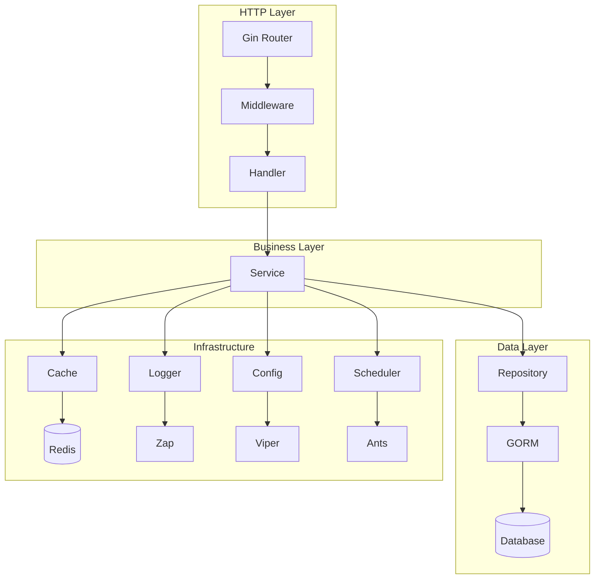

# Rei0721 项目完整文档

## 📋 项目概述

Rei0721 是一个基于 Go 语言开发的现代化 Web 应用框架，采用分层架构设计，提供完整的用户管理、配置管理、缓存、日志、国际化等功能。项目遵循最佳实践，具有高性能、高可用性和良好的可扩展性。

### 🎯 核心特性

- **分层架构**: Handler → Service → Repository → Model 清晰分层
- **依赖注入**: 基于接口的依赖注入，便于测试和扩展
- **多数据库支持**: PostgreSQL、MySQL、SQLite
- **Redis 缓存**: 可选的 Redis 缓存支持
- **配置热重载**: 支持配置文件动态更新
- **国际化**: 多语言支持 (中文、英文)
- **结构化日志**: 基于 Zap 的高性能日志系统
- **任务调度**: 基于 Ants 的协程池调度器
- **优雅关闭**: 完整的应用生命周期管理
- **SQL 生成器**: 自动生成数据库 SQL 脚本
- **中间件系统**: 完整的 HTTP 中间件支持

### 🏗️ 技术栈

| 组件 | 技术选型 | 版本 | 说明 |
|------|----------|------|------|
| **Web 框架** | Gin | v1.11.0 | 高性能 HTTP 框架 |
| **数据库 ORM** | GORM | v1.31.1 | 功能强大的 ORM |
| **数据库驱动** | PostgreSQL/MySQL/SQLite | - | 多数据库支持 |
| **缓存** | Redis | v9.17.2 | 高性能缓存 |
| **日志** | Zap | v1.27.1 | 结构化日志 |
| **配置管理** | Viper | v1.21.0 | 配置文件管理 |
| **国际化** | go-i18n | v2.6.0 | 多语言支持 |
| **协程池** | Ants | v2.11.4 | 高性能协程池 |
| **ID 生成** | Snowflake | v0.3.0 | 分布式 ID 生成 |
| **密码加密** | bcrypt | - | 安全密码加密 |

## 🏛️ 项目架构

### 目录结构

```
rei0721/
├── cmd/                    # 命令行工具
│   ├── server/            # HTTP 服务器启动入口
│   └── sqlgen/            # SQL 生成器工具
├── internal/              # 内部业务逻辑 (不对外暴露)
│   ├── app/               # 应用程序容器和生命周期管理
│   ├── config/            # 配置管理
│   ├── daemons/           # 守护进程 (HTTP 服务器等)
│   ├── handler/           # HTTP 处理器 (控制器层)
│   ├── middleware/        # HTTP 中间件
│   ├── models/            # 数据模型
│   ├── repository/        # 数据访问层
│   ├── router/            # 路由配置
│   └── service/           # 业务逻辑层
├── pkg/                   # 公共包 (可被外部项目使用)
│   ├── cache/             # 缓存抽象层
│   ├── daemon/            # 守护进程管理
│   ├── database/          # 数据库抽象层
│   ├── i18n/              # 国际化
│   ├── id/                # ID 生成器
│   ├── logger/            # 日志系统
│   ├── scheduler/         # 任务调度器
│   └── sqlgen/            # SQL 生成器
├── configs/               # 配置文件
├── locales/               # 国际化文件
├── sql/                   # 数据库脚本
├── logs/                  # 日志文件
└── docs/                  # 项目文档
```

### 分层架构



### 依赖关系

- **pkg/** 包不能导入 **internal/** 包 (架构约束)
- **internal/handler** 依赖 **internal/service**
- **internal/service** 依赖 **internal/repository**
- **internal/repository** 依赖 **internal/models**
- 所有层都可以使用 **pkg/** 中的公共包

## 🚀 快速开始

### 环境要求

- Go 1.24.6+
- PostgreSQL 12+ / MySQL 8.0+ / SQLite 3.0+
- Redis 6.0+ (可选)

### 安装步骤

1. **克隆项目**
```bash
git clone https://github.com/rei0721/rei0721.git
cd rei0721
```

2. **安装依赖**
```bash
go mod download
```

3. **配置环境**
```bash
# 复制配置文件
cp .env.example .env
cp configs/config.example.yaml configs/config.yaml

# 编辑配置文件
vim .env
vim configs/config.yaml
```

4. **初始化数据库**
```bash
# 生成 SQL 脚本
go run ./cmd/sqlgen/main.go -dialect postgres -output ./sql/postgres

# 执行 SQL 脚本 (以 PostgreSQL 为例)
psql -U postgres -d rei0721 -f ./sql/postgres/init.sql
```

5. **启动服务**
```bash
go run ./cmd/server/main.go
```

6. **验证服务**
```bash
curl http://localhost:8080/health
```

### Docker 部署

```bash
# 构建镜像
docker build -t rei0721:latest .

# 启动服务
docker-compose up -d
```

## ⚙️ 配置管理

### 配置文件结构

```yaml
server:
  port: 8080
  mode: debug
  readTimeout: 10
  writeTimeout: 10

database:
  driver: postgres
  host: localhost
  port: 5432
  user: postgres
  password: password
  dbname: rei0721
  maxOpenConns: 100
  maxIdleConns: 10

redis:
  enabled: true
  host: localhost
  port: 6379
  password: ""
  db: 0
  poolSize: 10

logger:
  level: info
  format: json
  output: stdout

i18n:
  default: zh-CN
  supported:
    - zh-CN
    - en-US
```

### 环境变量支持

配置文件支持环境变量替换：

```yaml
database:
  host: ${DB_HOST:localhost}
  port: ${DB_PORT:5432}
  password: ${DB_PASSWORD:password}
```

### 配置热重载

项目支持配置文件热重载，修改配置文件后会自动生效：

- Redis 配置变更会重新连接
- 日志级别变更会立即生效
- 服务器配置变更会在下次重启时生效

## 🗄️ 数据库设计

### 用户模型

```go
type User struct {
    BaseModel
    Username string `gorm:"uniqueIndex;size:50;not null" json:"username"`
    Email    string `gorm:"uniqueIndex;size:100;not null" json:"email"`
    Password string `gorm:"size:255;not null" json:"-"`
    Status   int    `gorm:"default:1" json:"status"`
}
```

### 基础模型

```go
type BaseModel struct {
    ID        int64          `gorm:"primarykey" json:"id"`
    CreatedAt time.Time      `json:"createdAt"`
    UpdatedAt time.Time      `json:"updatedAt"`
    DeletedAt gorm.DeletedAt `gorm:"index" json:"-"`
}
```

### SQL 生成器

项目提供了强大的 SQL 生成器，可以根据 GORM 模型自动生成：

- 建表语句 (CREATE TABLE)
- CRUD 操作语句 (INSERT, SELECT, UPDATE, DELETE)
- 索引创建语句
- 支持多数据库方言

```bash
# 生成 PostgreSQL SQL
go run ./cmd/sqlgen/main.go -dialect postgres -output ./sql/postgres

# 生成 MySQL SQL
go run ./cmd/sqlgen/main.go -dialect mysql -output ./sql/mysql

# 生成 SQLite SQL
go run ./cmd/sqlgen/main.go -dialect sqlite -output ./sql/sqlite
```

## 🔧 API 设计

### RESTful API

项目遵循 RESTful API 设计规范：

| 方法 | 路径 | 描述 |
|------|------|------|
| POST | `/api/v1/users/register` | 用户注册 |
| POST | `/api/v1/users/login` | 用户登录 |
| GET | `/api/v1/users/:id` | 获取用户信息 |
| GET | `/api/v1/users` | 获取用户列表 |

### 统一响应格式

```json
{
  "code": 0,
  "message": "success",
  "data": {
    "id": 1,
    "username": "alice",
    "email": "alice@example.com",
    "status": 1,
    "createdAt": "2025-12-31T10:00:00Z",
    "updatedAt": "2025-12-31T10:00:00Z"
  },
  "traceId": "req-123456789",
  "serverTime": "2025-12-31T10:00:00Z"
}
```

### 错误处理

项目使用分段错误码系统：

- **0**: 成功
- **1000-1999**: 参数错误 (400 Bad Request)
- **2000-2999**: 业务错误 (422 Unprocessable Entity)
- **3000-3999**: 认证错误 (401 Unauthorized)
- **4000-4999**: 资源不存在 (404 Not Found)
- **5000-5999**: 系统错误 (500 Internal Server Error)

## 🔍 中间件系统

### 内置中间件

1. **日志中间件**: 记录请求日志
2. **追踪中间件**: 生成请求追踪 ID
3. **恢复中间件**: 处理 panic 恢复
4. **国际化中间件**: 处理多语言
5. **配置中间件**: 注入配置信息

### 自定义中间件

```go
func CustomMiddleware() gin.HandlerFunc {
    return func(c *gin.Context) {
        // 前置处理
        start := time.Now()
        
        // 继续处理请求
        c.Next()
        
        // 后置处理
        duration := time.Since(start)
        log.Printf("Request took %v", duration)
    }
}
```

## 📊 监控和日志

### 结构化日志

项目使用 Zap 提供高性能结构化日志：

```go
logger.Info("user registered successfully",
    "userId", user.ID,
    "username", user.Username,
    "traceId", traceID,
)
```

### 日志配置

```yaml
logger:
  level: info        # debug, info, warn, error
  format: json       # json, console
  output: stdout     # stdout, file
```

### 请求追踪

每个请求都会生成唯一的追踪 ID，便于问题排查：

```
X-Request-ID: req-1735632000-abc123
```

## 🌐 国际化支持

### 语言配置

```yaml
i18n:
  default: zh-CN
  supported:
    - zh-CN
    - en-US
```

### 消息文件

**locales/zh-CN.yaml**
```yaml
welcome: "欢迎使用 Rei0721"
user:
  registered: "用户注册成功"
  login_success: "登录成功"
```

**locales/en-US.yaml**
```yaml
welcome: "Welcome to Rei0721"
user:
  registered: "User registered successfully"
  login_success: "Login successful"
```

### 使用方式

```go
// 在处理器中使用
message := i18n.Get(c, "user.registered")
```

## 🔄 任务调度

### 协程池

项目使用 Ants 协程池进行任务调度：

```go
// 提交异步任务
scheduler.Submit(ctx, func() {
    // 发送欢迎邮件
    sendWelcomeEmail(user.Email)
})
```

### 配置

```go
scheduler, err := scheduler.New(&scheduler.Config{
    PoolSize:       10000,
    ExpiryDuration: time.Second,
})
```

## 🧪 测试

### 单元测试

```bash
# 运行所有测试
go test ./...

# 运行特定包的测试
go test ./internal/service

# 运行测试并显示覆盖率
go test -cover ./...
```

### 集成测试

```bash
# 运行集成测试
go test -tags=integration ./...
```

### 性能测试

```bash
# 运行基准测试
go test -bench=. ./...
```

## 📦 部署

### 生产环境配置

```yaml
server:
  mode: release
  port: 8080

database:
  maxOpenConns: 100
  maxIdleConns: 50

redis:
  enabled: true
  poolSize: 50

logger:
  level: info
  format: json
  output: file
```

### Docker 部署

**Dockerfile**
```dockerfile
FROM golang:1.24-alpine AS builder
WORKDIR /app
COPY . .
RUN go build -o rei0721 ./cmd/server

FROM alpine:latest
RUN apk --no-cache add ca-certificates
WORKDIR /root/
COPY --from=builder /app/rei0721 .
COPY --from=builder /app/configs ./configs
COPY --from=builder /app/locales ./locales
CMD ["./rei0721"]
```

**docker-compose.yml**
```yaml
version: '3.8'
services:
  app:
    build: .
    ports:
      - "8080:8080"
    environment:
      - DB_HOST=postgres
      - REDIS_HOST=redis
    depends_on:
      - postgres
      - redis

  postgres:
    image: postgres:15
    environment:
      POSTGRES_DB: rei0721
      POSTGRES_USER: postgres
      POSTGRES_PASSWORD: password
    volumes:
      - postgres_data:/var/lib/postgresql/data

  redis:
    image: redis:7-alpine
    volumes:
      - redis_data:/data

volumes:
  postgres_data:
  redis_data:
```

### Kubernetes 部署

```yaml
apiVersion: apps/v1
kind: Deployment
metadata:
  name: rei0721
spec:
  replicas: 3
  selector:
    matchLabels:
      app: rei0721
  template:
    metadata:
      labels:
        app: rei0721
    spec:
      containers:
      - name: rei0721
        image: rei0721:latest
        ports:
        - containerPort: 8080
        env:
        - name: DB_HOST
          value: "postgres-service"
        - name: REDIS_HOST
          value: "redis-service"
```

## 🔧 开发指南

### 代码规范

1. **命名规范**
   - 包名：小写，简短，有意义
   - 变量名：驼峰命名
   - 常量名：大写，下划线分隔
   - 接口名：以 -er 结尾

2. **注释规范**
   - 公共函数必须有注释
   - 复杂逻辑必须有注释
   - 包级别注释说明包的用途

3. **错误处理**
   - 使用 errors.New() 创建错误
   - 使用 fmt.Errorf() 包装错误
   - 不要忽略错误

### 添加新功能

1. **定义模型** (internal/models)
2. **创建 Repository** (internal/repository)
3. **实现 Service** (internal/service)
4. **添加 Handler** (internal/handler)
5. **配置路由** (internal/router)
6. **编写测试**

### 最佳实践

1. **依赖注入**: 使用接口而非具体实现
2. **错误处理**: 统一错误码和错误处理
3. **日志记录**: 记录关键操作和错误
4. **配置管理**: 使用配置文件而非硬编码
5. **测试覆盖**: 保持高测试覆盖率

## 📈 性能优化

### 数据库优化

1. **连接池配置**
```yaml
database:
  maxOpenConns: 100  # 根据并发量调整
  maxIdleConns: 50   # 保持适量空闲连接
```

2. **索引优化**
```go
// 在模型中添加索引
Username string `gorm:"uniqueIndex;size:50"`
Email    string `gorm:"uniqueIndex;size:100"`
```

3. **查询优化**
```go
// 使用预加载避免 N+1 问题
db.Preload("Profile").Find(&users)

// 使用选择字段减少数据传输
db.Select("id", "username", "email").Find(&users)
```

### 缓存优化

1. **Redis 配置**
```yaml
redis:
  poolSize: 50      # 连接池大小
  minIdleConns: 10  # 最小空闲连接
```

2. **缓存策略**
```go
// 缓存用户信息
key := fmt.Sprintf("user:%d", userID)
cache.Set(ctx, key, user, time.Hour)
```

### 并发优化

1. **协程池**
```go
// 使用协程池避免协程泄漏
scheduler.Submit(ctx, func() {
    // 异步任务
})
```

2. **上下文传递**
```go
// 使用上下文控制超时和取消
ctx, cancel := context.WithTimeout(context.Background(), 5*time.Second)
defer cancel()
```

## 🔒 安全考虑

### 密码安全

```go
// 使用 bcrypt 加密密码
hashedPassword, err := bcrypt.GenerateFromPassword([]byte(password), bcrypt.DefaultCost)

// 验证密码
err := bcrypt.CompareHashAndPassword([]byte(hashedPassword), []byte(password))
```

### 输入验证

```go
type RegisterRequest struct {
    Username string `json:"username" binding:"required,min=3,max=50"`
    Email    string `json:"email" binding:"required,email"`
    Password string `json:"password" binding:"required,min=6"`
}
```

### SQL 注入防护

```go
// 使用 GORM 的参数化查询
db.Where("username = ?", username).First(&user)
```

### CORS 配置

```go
// 配置 CORS 中间件
router.Use(cors.New(cors.Config{
    AllowOrigins:     []string{"https://example.com"},
    AllowMethods:     []string{"GET", "POST", "PUT", "DELETE"},
    AllowHeaders:     []string{"Origin", "Content-Type", "Authorization"},
    AllowCredentials: true,
}))
```

## 🚨 故障排查

### 常见问题

1. **数据库连接失败**
```bash
# 检查数据库服务状态
systemctl status postgresql

# 检查连接配置
ping database_host
telnet database_host 5432
```

2. **Redis 连接失败**
```bash
# 检查 Redis 服务状态
systemctl status redis

# 测试连接
redis-cli ping
```

3. **配置文件错误**
```bash
# 验证 YAML 语法
yamllint configs/config.yaml

# 检查环境变量
env | grep DB_
```

### 日志分析

```bash
# 查看应用日志
tail -f logs/app.log

# 过滤错误日志
grep "ERROR" logs/app.log

# 按追踪 ID 查找相关日志
grep "req-123456789" logs/app.log
```

### 性能分析

```bash
# 生成 CPU 性能分析
go tool pprof http://localhost:8080/debug/pprof/profile

# 生成内存分析
go tool pprof http://localhost:8080/debug/pprof/heap
```

## 📚 参考资料

### 官方文档

- [Go 官方文档](https://golang.org/doc/)
- [Gin 框架文档](https://gin-gonic.com/docs/)
- [GORM 文档](https://gorm.io/docs/)
- [Viper 配置管理](https://github.com/spf13/viper)
- [Zap 日志库](https://github.com/uber-go/zap)

### 最佳实践

- [Go 代码规范](https://github.com/golang/go/wiki/CodeReviewComments)
- [项目布局标准](https://github.com/golang-standards/project-layout)
- [Go 并发模式](https://blog.golang.org/pipelines)

### 社区资源

- [Go 语言中文网](https://studygolang.com/)
- [Awesome Go](https://github.com/avelino/awesome-go)
- [Go 语言圣经](https://gopl-zh.github.io/)

---

**文档版本**: v1.0  
**最后更新**: 2025-12-31  
**维护者**: Rei0721 Team