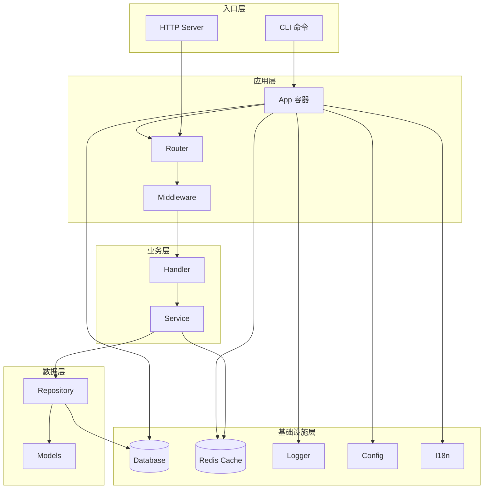

# 架构概述

> 分层架构与组件关系

---

## Purpose

阐述项目的整体架构设计和组件依赖关系。

## Scope

系统架构层面。

## Status

**Active**

---

## 分层架构



---

## 依赖注入流程

App 容器按以下顺序初始化组件：

```
Config → Logger → I18n → Database → Cache → Repository → Service → Handler → Router
```

**设计理由**：

- Config 是所有组件的基础
- Logger 需要尽早初始化以记录启动日志
- 数据库和缓存在业务组件之前初始化
- Repository → Service → Handler 遵循依赖顺序

---

## 组件生命周期

### 启动阶段

1. 加载配置（支持热重载）
2. 初始化日志器
3. 建立数据库连接
4. 连接 Redis（可选）
5. 注册路由
6. 启动 HTTP 服务器

### 关闭阶段（逆序）

1. 停止接收新请求
2. 等待现有请求完成
3. 关闭数据库连接
4. 关闭 Redis 连接
5. 刷新日志缓冲

---

## 核心组件

| 组件       | 路径                   | 职责                  |
| ---------- | ---------------------- | --------------------- |
| App        | `internal/app/`        | DI 容器，生命周期管理 |
| Config     | `internal/config/`     | 配置加载与热重载      |
| Router     | `internal/router/`     | 路由注册              |
| Handler    | `internal/handler/`    | HTTP 请求处理         |
| Service    | `internal/service/`    | 业务逻辑              |
| Repository | `internal/repository/` | 数据访问              |

---

## pkg 公共库

| 包             | 职责         |
| -------------- | ------------ |
| `pkg/cli`      | CLI 框架     |
| `pkg/database` | GORM 封装    |
| `pkg/cache`    | Redis 封装   |
| `pkg/logger`   | Zap 日志封装 |
| `pkg/i18n`     | 国际化       |
| `pkg/executor` | 任务执行器   |
| `pkg/sqlgen`   | SQL 代码生成 |

---

## Evidence

- DI 容器：[internal/app/app.go](../internal/app/app.go)
- 路由：[internal/router/router.go](../internal/router/router.go)

## Related

- [开发指南](../guides/development.md)
- [ADR-001: 技术选型](adr-001-tech-stack.md)

## Changelog

| 日期       | 变更     |
| ---------- | -------- |
| 2026-01-14 | 初始创建 |
