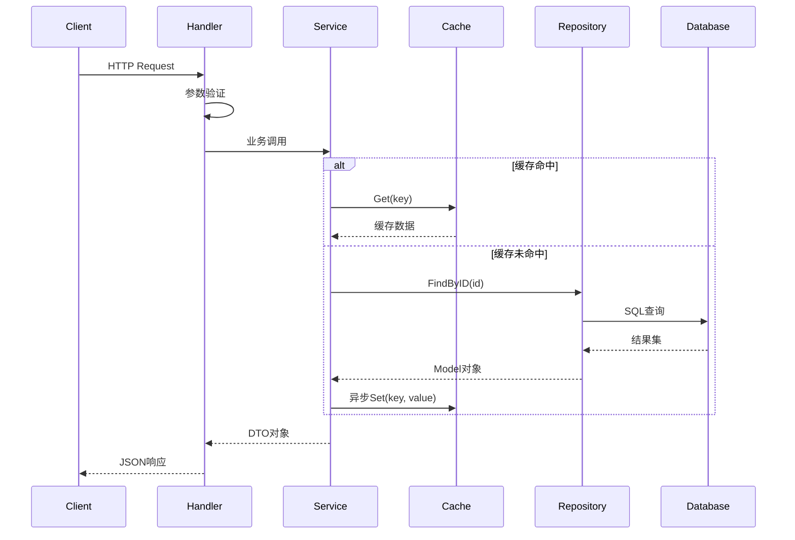

# Service层架构设计

> **设计目标**  
> 定义 `internal/service` 层的标准架构模式、最佳实践和开发规范。

---

## 1. Service层定位

### 1.1 职责边界

Service层是**业务逻辑层**，位于Handler和Repository之间：

```
Handler (HTTP处理) → Service (业务逻辑) → Repository (数据访问) → Database
```

**核心职责**：

| 职责             | 说明                           | 示例                                 |
| ---------------- | ------------------------------ | ------------------------------------ |
| **业务逻辑编排** | 协调多个Repository完成复杂业务 | 用户注册时检查用户名+邮箱唯一性      |
| **事务管理**     | 跨Repository的事务控制         | 转账操作涉及两个账户更新             |
| **缓存策略**     | 读写缓存的一致性保证           | Cache-Aside模式                      |
| **业务验证**     | 领域级别的验证规则             | 密码强度、用户状态检查               |
| **数据转换**     | Model ↔ DTO转换                | `models.User` → `types.UserResponse` |
| **异步任务**     | 非核心流程的异步处理           | 发送欢迎邮件、记录审计日志           |

**不属于Service层**：

- ❌ HTTP参数解析和验证 (Handler层负责)
- ❌ SQL语句编写 (Repository层负责)
- ❌ 具体的缓存键生成规则 (constants定义)

### 1.2 分层数据流



---

## 2. 标准文件结构

### 2.1 目录组织

```
internal/service/
├── base_service.go          # BaseService 泛型基类
├── constants.go             # Service层公共常量
├── user.go                  # 用户业务接口定义
├── user_impl.go             # 用户业务实现
├── user_test.go             # 用户业务单元测试
├── order.go                 # 订单业务接口 (示例)
├── order_impl.go            # 订单业务实现
└── ...
```

### 2.2 文件命名约定

| 文件类型     | 命名规则           | 内容                    |
| ------------ | ------------------ | ----------------------- |
| **接口定义** | `<domain>.go`      | 接口声明 + 详细注释     |
| **接口实现** | `<domain>_impl.go` | 具体实现 + 内部辅助函数 |
| **单元测试** | `<domain>_test.go` | 测试用例                |
| **基础类**   | `base_service.go`  | 泛型基类                |
| **常量**     | `constants.go`     | 缓存键、TTL等           |

---

## 3. BaseService泛型设计

### 3.1 核心设计

**文件**: [`internal/service/base_service.go`](file:///d:/coder/go/go-scaffold/refactor/go-scaffold/internal/service/base_service.go)

```go
type BaseService[T any] struct {
    Repo     repository.Repository[T]  // 必须依赖，直接声明
    Executor atomic.Value               // executor.Manager (可选)
    Cache    atomic.Value               // cache.Cache (可选)
    Logger   atomic.Value               // logger.Logger (可选)
    JWT      atomic.Value               // jwt.JWT (可选，认证服务需要)
}
```

**设计亮点**：

1. **泛型参数 `T`**: 对应的 Model 类型（如 `models.User`）
2. **Repository 必须依赖**: 无缓存或Executor也能工作
3. **`atomic.Value` 延迟注入**: 解耦初始化顺序依赖
4. **线程安全**: `atomic.Value` 保证并发读写安全

### 3.2 依赖获取方法

```go
// 获取 Executor (带空值检查)
func (s *BaseService[T]) getExecutor() executor.Manager {
    if exec := s.Executor.Load(); exec != nil {
        return exec.(executor.Manager)
    }
    return nil
}

// 获取 Cache (带空值检查)
func (s *BaseService[T]) getCache() cache.Cache {
    if c := s.Cache.Load(); c != nil {
        return c.(cache.Cache)
    }
    return nil
}

// 获取 Logger (带空值检查)
func (s *BaseService[T]) getLogger() logger.Logger {
    if l := s.Logger.Load(); l != nil {
        return l.(logger.Logger)
    }
    return nil
}

// 获取 JWT (带空值检查)
func (s *BaseService[T]) getJWT() jwt.JWT {
    if j := s.JWT.Load(); j != nil {
        return j.(jwt.JWT)
    }
    return nil
}
```

**使用模式**：

```go
// ✅ 正确: 先检查是否存在
if log := s.getLogger(); log != nil {
    log.Info("operation started", "userId", id)
}

// ✅ 正确: 降级处理
if cache := s.getCache(); cache != nil {
    // 使用缓存
} else {
    // 直接查数据库
}

// ❌ 错误: 假设依赖一定存在
s.getLogger().Info("message") // 可能 panic!
```

---

## 4. 接口定义规范

### 4.1 接口文件模板

**文件**: `internal/service/<domain>.go`

```go
package service

import (
    "context"
    "github.com/rei0721/go-scaffold/types"
)

// UserService 定义用户相关业务操作的接口
//
// 设计原则:
// - 定义契约: 明确业务层提供哪些功能
// - 依赖倒置: Handler层依赖接口而非实现
// - 便于测试: 可以创建mock实现进行单元测试
type UserService interface {
    // Register 创建一个新的用户账户
    //
    // 参数:
    //   ctx: 上下文，用于传递请求超时、TraceID等元数据
    //   req: 注册请求，包含用户名、邮箱和密码
    //
    // 返回:
    //   *types.UserResponse: 创建成功的用户信息(不含密码)
    //   error: 业务错误，如:
    //     - ErrDuplicateUsername: 用户名已存在
    //     - ErrDuplicateEmail: 邮箱已存在
    //     - ErrDatabaseError: 数据库错误
    //
    // 业务流程:
    //   1. 验证用户名是否已存在
    //   2. 验证邮箱是否已存在
    //   3. 对密码进行加密(bcrypt)
    //   4. 创建用户记录
    //   5. 触发异步后续任务(如发送欢迎邮件)
    Register(ctx context.Context, req *types.RegisterRequest) (*types.UserResponse, error)

    // 其他方法...
}
```

### 4.2 注释规范

**接口级别注释**：

- 说明接口的用途
- 设计原则和约束
- 与其他Service的关系

**方法级别注释**：

- 一句话功能描述
- 参数说明（用途、格式、约束）
- 返回值说明（成功/失败情况）
- 可能的错误类型
- 业务流程步骤（复杂业务）

---

## 5. 实现文件规范

### 5.1 实现结构

**文件**: `internal/service/<domain>_impl.go`

```go
package service

import (
    "context"
    "github.com/rei0721/go-scaffold/internal/models"
    "github.com/rei0721/go-scaffold/internal/repository"
    "github.com/rei0721/go-scaffold/types"
)

// userService 实现 UserService 接口
// 小写开头，不导出
type userService struct {
    BaseService[models.User]  // 嵌入泛型基类
}

// NewUserService 创建一个新的 UserService 实例
//
// 参数:
//   repo: 用户仓库接口
//
// 返回:
//   UserService 接口（而不是具体类型）
//
// 注意:
//   Executor、Cache、Logger、JWT 需要通过延迟注入
func NewUserService(repo repository.UserRepository) UserService {
    return &userService{
        BaseService: BaseService[models.User]{
            Repo: repo,
        },
    }
}

// 实现接口方法...
func (s *userService) Register(ctx context.Context, req *types.RegisterRequest) (*types.UserResponse, error) {
    // 业务逻辑实现
}
```

### 5.2 内部辅助函数

```go
// toUserResponse 将 User 模型转换为 UserResponse
// 这是一个内部辅助函数，小写开头不导出
func toUserResponse(user *models.User) *types.UserResponse {
    return &types.UserResponse{
        UserID:    user.ID,
        Username:  user.Username,
        Email:     user.Email,
        Status:    user.Status,
        CreatedAt: user.CreatedAt,
        // 注意: 没有包含 Password 字段
    }
}

// userCacheKey 生成用户缓存键
func userCacheKey(id int64) string {
    return fmt.Sprintf("%s%d", CacheKeyPrefixUser, id)
}
```

---

## 6. 依赖注入模式

### 6.1 构造函数设计

**原则**: 只注入必须依赖（Repository）

```go
// ✅ 推荐: 只注入Repository
func NewUserService(repo repository.UserRepository) UserService {
    return &userService{
        BaseService: BaseService[models.User]{
            Repo: repo,
        },
    }
}

// ❌ 不推荐: 注入所有依赖
func NewUserService(
    repo repository.UserRepository,
    cache cache.Cache,
    executor executor.Manager,
    logger logger.Logger,
) UserService {
    // 这样会导致初始化顺序耦合
}
```

### 6.2 延迟注入集成

**在 `internal/app/app_business.go` 中**：

```go
// 1. 创建Service (只注入Repository)
userService := service.NewUserService(userRepo)

// 2. 延迟注入可选依赖 (通过类型断言)
if s, ok := userService.(interface{ SetCache(cache.Cache) }); ok {
    s.SetCache(app.Cache)
}
if s, ok := userService.(interface{ SetExecutor(executor.Manager) }); ok {
    s.SetExecutor(app.Executor)
}
if s, ok := userService.(interface{ SetLogger(logger.Logger) }); ok {
    s.SetLogger(app.Logger)
}
if s, ok := userService.(interface{ SetJWT(jwt.JWT) }); ok {
    s.SetJWT(app.JWT)
}
```

**优点**：

- ✅ Service可以在Executor、Cache之前创建
- ✅ 测试时可以只注入必要的依赖
- ✅ 支持运行时动态替换依赖

---

## 7. 缓存策略规范

### 7.1 Cache-Aside 模式

**标准实现**：

```go
func (s *userService) GetByID(ctx context.Context, id int64) (*types.UserResponse, error) {
    // 1. 尝试从缓存读取
    if c := s.getCache(); c != nil {
        key := userCacheKey(id)
        if data, err := c.Get(ctx, key); err == nil {
            var user models.User
            if err := json.Unmarshal([]byte(data), &user); err == nil {
                // 缓存命中
                return toUserResponse(&user), nil
            }
            // JSON解析失败，继续查数据库
        }
        // 缓存未命中或读取失败，继续查数据库
    }

    // 2. 查询数据库
    user, err := s.Repo.FindByID(ctx, id)
    if err != nil {
        return nil, errors.NewBizError(errors.ErrDatabaseError, "failed to find user").WithCause(err)
    }
    if user == nil {
        return nil, errors.NewBizError(errors.ErrUserNotFound, "user not found")
    }

    // 3. 异步写入缓存（不阻塞主流程）
    if c := s.getCache(); c != nil {
        if exec := s.getExecutor(); exec != nil {
            userCopy := *user  // 复制以避免并发问题
            _ = exec.Execute(constants.PoolCache, func() {
                key := userCacheKey(userCopy.ID)
                if data, err := json.Marshal(userCopy); err == nil {
                    _ = c.Set(context.Background(), key, string(data), CacheTTLUser)
                }
            })
        }
    }

    return toUserResponse(user), nil
}
```

### 7.2 缓存失效策略

**更新/删除操作必须失效缓存**：

```go
func (s *userService) Update(ctx context.Context, id int64, req *types.UpdateUserRequest) (*types.UserResponse, error) {
    // 1. 业务逻辑...
    if err := s.Repo.Update(ctx, user); err != nil {
        return nil, errors.NewBizError(errors.ErrDatabaseError, "failed to update user").WithCause(err)
    }

    // 2. 异步失效缓存
    s.invalidateUserCache(id)

    return toUserResponse(user), nil
}

// invalidateUserCache 失效用户缓存
func (s *userService) invalidateUserCache(id int64) {
    if c := s.getCache(); c != nil {
        if exec := s.getExecutor(); exec != nil {
            key := userCacheKey(id)
            _ = exec.Execute(constants.PoolCache, func() {
                _ = c.Delete(context.Background(), key)
            })
        }
    }
}
```

### 7.3 缓存常量定义

**在 `internal/service/constants.go` 中**：

```go
package service

import "time"

const (
    // 缓存键前缀
    CacheKeyPrefixUser = "user:"
    CacheKeyPrefixRole = "role:"

    // 缓存过期时间
    CacheTTLUser = 30 * time.Minute
    CacheTTLRole = 60 * time.Minute
)
```

---

## 8. 错误处理规范

### 8.1 业务错误转换

**原则**: 将底层错误转换为业务错误

```go
// ✅ 正确: 使用 errors.NewBizError 包装
user, err := s.Repo.FindByID(ctx, id)
if err != nil {
    return nil, errors.NewBizError(errors.ErrDatabaseError, "failed to find user").WithCause(err)
}
if user == nil {
    return nil, errors.NewBizError(errors.ErrUserNotFound, "user not found")
}

// ❌ 错误: 直接返回底层错误
user, err := s.Repo.FindByID(ctx, id)
if err != nil {
    return nil, err  // 缺少业务上下文
}
```

### 8.2 常用错误码

使用 `types/errors` 包定义的业务错误：

```go
errors.ErrUserNotFound       // 用户不存在
errors.ErrDuplicateUsername  // 用户名重复
errors.ErrDuplicateEmail     // 邮箱重复
errors.ErrUnauthorized       // 认证失败
errors.ErrForbidden          // 权限不足
errors.ErrDatabaseError      // 数据库错误
errors.ErrInternalServer     // 内部错误
```

### 8.3 错误链保留

**使用 `WithCause` 保留原始错误**：

```go
if err := bcrypt.GenerateFromPassword([]byte(req.Password), bcrypt.DefaultCost); err != nil {
    return nil, errors.NewBizError(errors.ErrInternalServer, "failed to hash password").WithCause(err)
}
```

**好处**：

- ✅ 业务层返回统一的错误码
- ✅ 通过 `WithCause` 保留底层错误信息
- ✅ 便于调试和追踪问题

---

## 9. 日志记录规范

### 9.1 日志级别使用

| 级别      | 使用场景         | 示例                        |
| --------- | ---------------- | --------------------------- |
| **Debug** | 详细的调试信息   | 缓存命中/未命中、参数值     |
| **Info**  | 正常业务流程     | 用户注册成功、登录成功      |
| **Warn**  | 预期内的异常情况 | 密码错误、缓存读取失败      |
| **Error** | 系统错误         | 数据库连接失败、JWT生成失败 |

### 9.2 日志记录模式

```go
// 关键操作开始
if log := s.getLogger(); log != nil {
    log.Info("user update started", "userId", id)
}

// 操作成功
if log := s.getLogger(); log != nil {
    log.Info("user updated successfully", "userId", id)
}

// 预期内的失败 (Warn)
if log := s.getLogger(); log != nil {
    log.Warn("login failed: invalid password", "username", req.Username)
}

// 系统错误 (Error)
if log := s.getLogger(); log != nil {
    log.Error("failed to generate JWT token", "error", err, "userId", user.ID)
}
```

**原则**：

- ✅ 总是检查 Logger 是否存在
- ✅ 使用结构化字段（key-value对）
- ✅ 敏感信息不记录（如密码）
- ✅ 关键业务操作必须记录

---

## 10. 异步任务规范

### 10.1 Executor 池选择

使用 `types/constants/executor.go` 定义的池名：

| 池名                       | 用途              | 特点              |
| -------------------------- | ----------------- | ----------------- |
| `constants.PoolHTTP`       | HTTP请求异步处理  | 非阻塞，size: 200 |
| `constants.PoolDatabase`   | 数据库异步操作    | 阻塞，size: 50    |
| `constants.PoolCache`      | 缓存异步更新/失效 | 非阻塞，size: 30  |
| `constants.PoolLogger`     | 日志异步处理      | 阻塞，size: 10    |
| `constants.PoolBackground` | 通用后台任务      | 非阻塞，size: 30  |

### 10.2 异步任务模式

```go
// ✅ 正确: 复制数据避免并发问题
if exec := s.getExecutor(); exec != nil {
    userCopy := *user  // 重要: 复制数据
    _ = exec.Execute(constants.PoolBackground, func() {
        // 使用 userCopy 而不是 user
        sendWelcomeEmail(userCopy.Email)
    })
}

// ❌ 错误: 直接引用可能被修改的数据
if exec := s.getExecutor(); exec != nil {
    _ = exec.Execute(constants.PoolBackground, func() {
        sendWelcomeEmail(user.Email) // user 可能已被修改!
    })
}
```

### 10.3 使用场景

**适合异步处理的任务**：

- ✅ 发送邮件/短信通知
- ✅ 记录审计日志
- ✅ 缓存预热或失效
- ✅ 触发其他微服务的通知
- ✅ 数据统计和分析

**不适合异步处理**：

- ❌ 核心业务逻辑（如转账扣款）
- ❌ 需要立即返回结果的操作
- ❌ 事务内的关键步骤

---

## 11. 测试规范

### 11.1 单元测试结构

```go
func TestUserService_Register(t *testing.T) {
    // 1. 准备 Mock Repository
    mockRepo := &mockUserRepository{
        findByUsernameFunc: func(ctx context.Context, username string) (*models.User, error) {
            return nil, nil // 用户名不存在
        },
        findByEmailFunc: func(ctx context.Context, email string) (*models.User, error) {
            return nil, nil // 邮箱不存在
        },
        createFunc: func(ctx context.Context, user *models.User) error {
            user.ID = 123 // 模拟ID生成
            return nil
        },
    }

    // 2. 创建 Service
    svc := NewUserService(mockRepo)

    // 3. 执行测试
    resp, err := svc.Register(context.Background(), &types.RegisterRequest{
        Username: "testuser",
        Email:    "test@example.com",
        Password: "password123",
    })

    // 4. 断言
    assert.NoError(t, err)
    assert.NotNil(t, resp)
    assert.Equal(t, int64(123), resp.UserID)
    assert.Equal(t, "testuser", resp.Username)
}
```

### 11.2 Mock Repository 模式

```go
type mockUserRepository struct {
    findByIDFunc       func(context.Context, int64) (*models.User, error)
    findByUsernameFunc func(context.Context, string) (*models.User, error)
    findByEmailFunc    func(context.Context, string) (*models.User, error)
    createFunc         func(context.Context, *models.User) error
    updateFunc         func(context.Context, *models.User) error
    deleteFunc         func(context.Context, int64) error
}

func (m *mockUserRepository) FindByID(ctx context.Context, id int64) (*models.User, error) {
    if m.findByIDFunc != nil {
        return m.findByIDFunc(ctx, id)
    }
    return nil, nil
}

// 其他方法实现...
```

### 11.3 表驱动测试

对于需要多个测试用例的方法：

```go
func TestUserService_Login(t *testing.T) {
    tests := []struct {
        name        string
        setupMock   func(*mockUserRepository)
        request     *types.LoginRequest
        wantErr     bool
        expectedErr error
    }{
        {
            name: "成功登录",
            setupMock: func(m *mockUserRepository) {
                hashedPwd, _ := bcrypt.GenerateFromPassword([]byte("password123"), bcrypt.DefaultCost)
                m.findByUsernameFunc = func(ctx context.Context, username string) (*models.User, error) {
                    return &models.User{
                        ID:       1,
                        Username: "testuser",
                        Password: string(hashedPwd),
                        Status:   1,
                    }, nil
                }
            },
            request: &types.LoginRequest{
                Username: "testuser",
                Password: "password123",
            },
            wantErr: false,
        },
        {
            name: "用户不存在",
            setupMock: func(m *mockUserRepository) {
                m.findByUsernameFunc = func(ctx context.Context, username string) (*models.User, error) {
                    return nil, nil
                }
            },
            request: &types.LoginRequest{
                Username: "nonexistent",
                Password: "password123",
            },
            wantErr:     true,
            expectedErr: errors.ErrUserNotFound,
        },
        {
            name: "密码错误",
            setupMock: func(m *mockUserRepository) {
                hashedPwd, _ := bcrypt.GenerateFromPassword([]byte("correctpassword"), bcrypt.DefaultCost)
                m.findByUsernameFunc = func(ctx context.Context, username string) (*models.User, error) {
                    return &models.User{
                        ID:       1,
                        Username: "testuser",
                        Password: string(hashedPwd),
                        Status:   1,
                    }, nil
                }
            },
            request: &types.LoginRequest{
                Username: "testuser",
                Password: "wrongpassword",
            },
            wantErr:     true,
            expectedErr: errors.ErrUnauthorized,
        },
    }

    for _, tt := range tests {
        t.Run(tt.name, func(t *testing.T) {
            mockRepo := &mockUserRepository{}
            tt.setupMock(mockRepo)
            svc := NewUserService(mockRepo)

            resp, err := svc.Login(context.Background(), tt.request)

            if tt.wantErr {
                assert.Error(t, err)
                if tt.expectedErr != nil {
                    assert.True(t, errors.Is(err, tt.expectedErr))
                }
            } else {
                assert.NoError(t, err)
                assert.NotNil(t, resp)
                assert.NotEmpty(t, resp.Token)
            }
        })
    }
}
```

---

## 12. 完整示例

### 12.1 接口定义 (`user.go`)

参考: [internal/service/user.go](file:///d:/coder/go/go-scaffold/refactor/go-scaffold/internal/service/user.go)

### 12.2 接口实现 (`user_impl.go`)

参考: [internal/service/user_impl.go](file:///d:/coder/go/go-scaffold/refactor/go-scaffold/internal/service/user_impl.go)

### 12.3 基类实现 (`base_service.go`)

参考: [internal/service/base_service.go](file:///d:/coder/go/go-scaffold/refactor/go-scaffold/internal/service/base_service.go)

---

## 13. 最佳实践总结

### 13.1 设计原则

1. **接口与实现分离** - 便于测试和替换实现
2. **泛型基类复用** - 避免重复的依赖管理代码
3. **延迟注入** - 解耦初始化顺序依赖
4. **降级策略** - 可选依赖缺失时优雅降级
5. **业务错误转换** - 统一的错误码和错误处理

### 13.2 代码质量

1. **详细注释** - 接口和方法的完整文档注释
2. **错误处理** - 显式处理所有错误，使用 `WithCause` 保留原始错误
3. **Context传递** - 所有I/O操作必须透传 Context
4. **日志记录** - 关键操作必须记录日志
5. **单元测试** - 所有公开方法必须有单元测试

### 13.3 性能优化

1. **异步处理** - 非核心任务使用 Executor 异步执行
2. **缓存策略** - 合理使用 Cache-Aside 模式
3. **数据复制** - 异步任务中复制数据避免并发问题
4. **连接池** - 复用数据库和Redis连接

---

## 14. 常见问题

### Q1: 为什么使用泛型 BaseService？

**A**: 泛型避免了每个Service都重复编写依赖管理代码（如 `getCache()`, `getLogger()` 等），提高代码复用性和可维护性。

### Q2: 为什么可选依赖使用 `atomic.Value`？

**A**: `atomic.Value` 提供：

- 线程安全的读写
- 支持运行时动态替换（如配置热重载）
- 解耦初始化顺序（Service可以在Cache之前创建）

### Q3: 为什么异步写入缓存而不是同步？

**A**: 避免缓存操作失败阻塞主流程，提高响应速度。缓存是性能优化手段，不应该影响业务正确性。

### Q4: Service层是否应该处理事务？

**A**: 简单事务可以在Service层通过 `db.Transaction()` 处理。复杂的分布式事务建议使用 Saga 模式或事件溯源。

### Q5: 如何为新业务创建Service？

**A**:

1. 创建 `<domain>.go` 定义接口
2. 创建 `<domain>_impl.go` 实现接口
3. 嵌入 `BaseService[YourModel]`
4. 在 `app_business.go` 中注册
5. 编写单元测试

---

## 15. 参考资料

### 内部文档

- [系统架构地图](file:///d:/coder/go/go-scaffold/refactor/go-scaffold/docs/architecture/system_map.md)
- [变量命名索引](file:///d:/coder/go/go-scaffold/refactor/go-scaffold/docs/architecture/variable_index.md)
- [AI 协作提示词](file:///d:/coder/go/go-scaffold/refactor/go-scaffold/docs/ai_prompt.md)

### 相关包文档

- [Cache 包文档](file:///d:/coder/go/go-scaffold/refactor/go-scaffold/pkg/cache/doc.go)
- [Executor 包文档](file:///d:/coder/go/go-scaffold/refactor/go-scaffold/pkg/executor/doc.go)
- [Logger 包文档](file:///d:/coder/go/go-scaffold/refactor/go-scaffold/pkg/logger/doc.go)

---

> **更新提醒**: 本文档应随 Service 层的设计演进持续更新。
