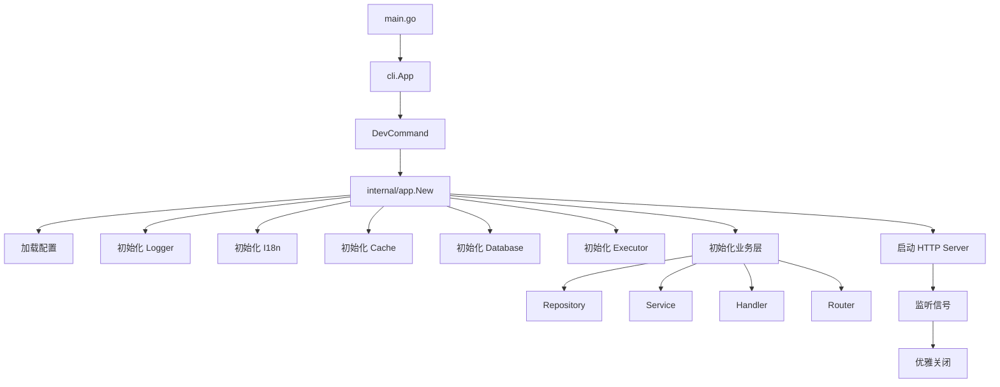
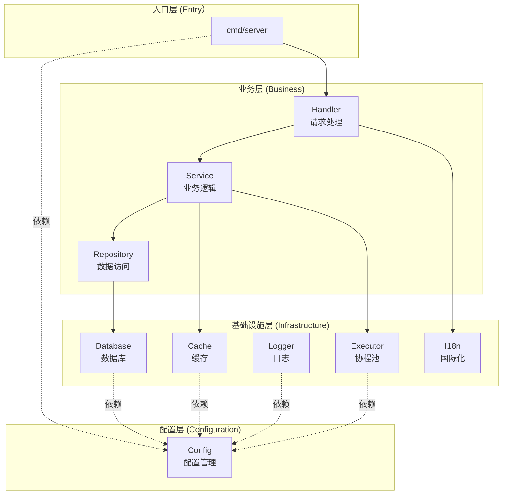
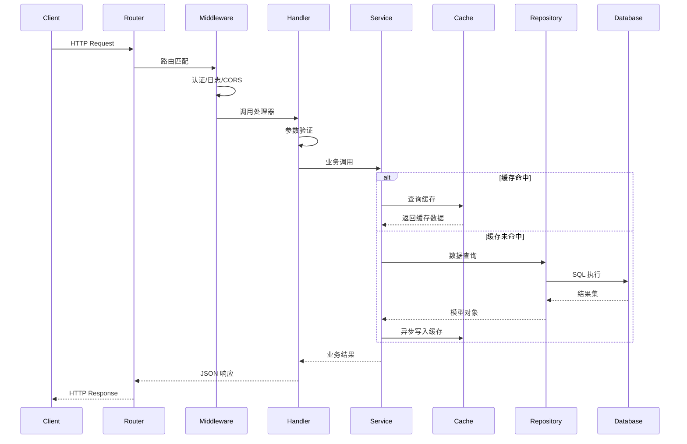
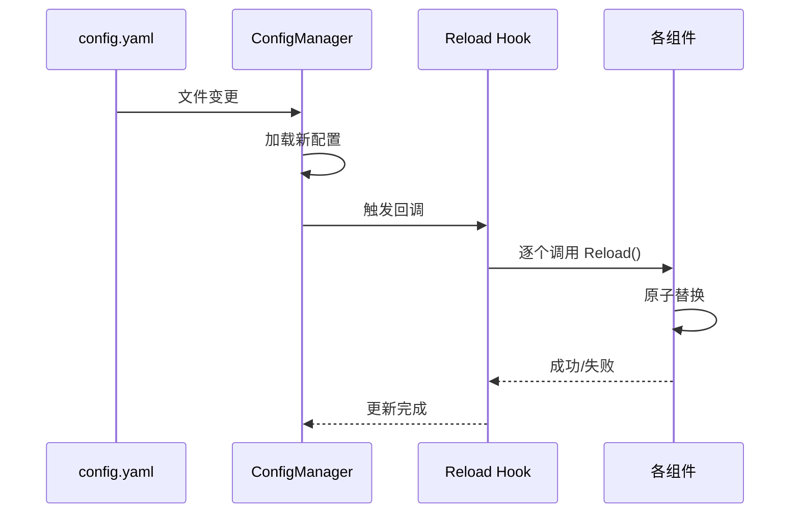

# 系统架构地图 (System Map)

> **项目唯一入口**  
> 本文件是理解整个系统的起点。修改代码前必须先阅读此文档。

---

## 📊 项目概览

### 基本信息

- **项目名称**: go-scaffold
- **版本**: v0.1.2
- **定位**: Go 语言后端脚手架（Backend Scaffold）
- **架构模式**: 分层架构 + 依赖注入 (DI)
- **部署模式**: 单体应用，支持容器化

### 技术栈

| 类别          | 技术选型  | 版本    | 用途             |
| ------------- | --------- | ------- | ---------------- |
| **语言**      | Go        | 1.24.6+ | 主要编程语言     |
| **HTTP 框架** | Gin       | v1.11.0 | RESTful API      |
| **ORM**       | GORM      | v1.31.1 | 数据库访问       |
| **配置管理**  | Viper     | v1.21.0 | 配置加载与热重载 |
| **日志**      | Zap       | v1.27.1 | 结构化日志       |
| **缓存**      | go-redis  | v9.17.2 | Redis 客户端     |
| **并发**      | ants      | v2.11.4 | 协程池管理       |
| **国际化**    | go-i18n   | v2.6.0  | 多语言支持       |
| **ID 生成**   | snowflake | v0.3.0  | 分布式 ID        |

### 核心依赖清单

详见 [`go.mod`](/go.mod)

---

## 📁 目录结构映射

```
go-scaffold/
├── cmd/                    # 命令行入口
│   └── server/            # 主服务器程序
│       ├── main.go        # 程序入口点
│       ├── server.go      # HTTP 服务器启动逻辑
│       └── sqlgen.go      # SQL 生成器命令
├── internal/              # 内部业务逻辑（不可导出）
│   ├── app/              # DI 容器与应用生命周期管理
│   ├── config/           # 配置结构定义与验证
│   ├── handler/          # HTTP 请求处理器
│   ├── middleware/       # HTTP 中间件
│   ├── models/           # 业务模型
│   ├── repository/       # 数据访问层
│   ├── router/           # 路由配置
│   ├── server/           # 服务器相关逻辑
│   └── service/          # 业务服务层
├── pkg/                   # 可复用基础库（可导出）
│   ├── cache/            # 缓存抽象（Redis）
│   ├── cli/              # CLI 框架
│   ├── database/         # 数据库抽象
│   ├── executor/         # 并发任务调度器
│   ├── httpserver/       # HTTP 服务器封装
│   ├── i18n/             # 国际化
│   ├── jwt/              # JWT 认证
│   ├── logger/           # 日志系统
│   ├── rbac/             # RBAC 权限控制
│   ├── sqlgen/           # SQL 生成器
│   └── utils/            # 工具函数
├── types/                 # 共享类型定义
│   ├── constants/        # 全局常量
│   ├── errors/           # 错误类型
│   ├── result/           # 响应结果封装
│   ├── request.go        # 通用请求类型
│   └── response.go       # 通用响应类型
├── configs/               # 配置文件
│   ├── config.yaml       # 主配置文件
│   ├── config.example.yaml  # 配置示例
│   └── locales/          # 国际化翻译文件
├── docs/                  # 项目文档（本协议新增）
└── specs/                 # 临时推演文档（本协议新增）
```

### 目录职责划分

| 目录        | 可见性 | 职责                     | 依赖方向                 |
| ----------- | ------ | ------------------------ | ------------------------ |
| `cmd/`      | 入口   | 程序启动、命令行参数解析 | 依赖 internal、pkg       |
| `internal/` | 私有   | 业务逻辑、HTTP 处理      | 依赖 pkg、types          |
| `pkg/`      | 公开   | 通用基础设施、抽象接口   | 无外部依赖（仅第三方库） |
| `types/`    | 公开   | 跨层共享的数据类型       | 无依赖                   |
| `configs/`  | 配置   | 静态配置文件             | -                        |

---

## 🏗️ 模块依赖关系

### 启动流程



### 分层架构



### 数据流向



---

## 🔧 关键组件说明

### 1. DI 容器 (`internal/app`)

**文件**: [`internal/app/app.go`](/internal/app/app.go)

**职责**:

- 按正确顺序初始化所有组件
- 管理组件生命周期（创建、运行、关闭）
- 提供统一的依赖注入入口

**初始化顺序**:

1. Config（配置）
2. Logger（日志）
3. I18n（国际化）
4. Cache（缓存，可选）
5. Database（数据库）
6. Executor（协程池，可选）
7. Business（业务层：Repository → Service → Handler → Router）

**关键方法**:

- `New(opts Options) (*App, error)` - 创建应用实例
- `Start(ctx context.Context) error` - 启动服务
- `Shutdown(ctx context.Context) error` - 优雅关闭

**启动模式**:

- `server` 模式（默认）：完整启动流程，包括所有组件和 HTTP 服务器
- `initdb` 模式：仅初始化到数据库，使用 sqlgen 生成并执行初始化脚本后退出
  - 生成 SQL 脚本到 `scripts/initdb/` 目录
  - 执行建表 SQL 语句
  - 创建锁文件 `.initialized` 防止重复初始化

### 2. 配置管理 (`internal/config`)

**文件**: [`internal/config/config.go`](/internal/config/config.go)

**职责**:

- 统一配置结构定义
- 配置验证 (`Validate()` 接口)
- 支持热重载（通过 Viper 监听文件变化）

**配置来源优先级**:

1. 环境变量（最高）
2. `.env` 文件
3. `config.yaml` 文件（默认）

**主要配置项**:

- `Server` - HTTP 服务器配置
- `Database` - 数据库连接配置
- `Redis` - 缓存配置
- `Logger` - 日志配置
- `I18n` - 国际化配置
- `Executor` - 协程池配置

### 3. Service 业务服务层 (`internal/service`)

**设计文档**: [`docs/architecture/service_design.md`](/docs/architecture/service_design.md)

**职责**:

- 业务逻辑编排（协调多个Repository）
- 事务管理（跨Repository的事务控制）
- 缓存策略（Cache-Aside模式）
- 业务验证（领域级别的验证规则）
- 数据转换（Model ↔ DTO）
- 异步任务（非核心流程的异步处理）

**核心设计**:

```go
// BaseService 泛型基类
type BaseService[T any] struct {
    Repo     repository.Repository[T]  // 必须依赖
    Executor atomic.Value               // executor.Manager (可选)
    Cache    atomic.Value               // cache.Cache (可选)
    Logger   atomic.Value               // logger.Logger (可选)
    JWT      atomic.Value               // jwt.JWT (可选)
}
```

**设计亮点**:

- ✅ **泛型基类** - 避免重复的依赖管理代码
- ✅ **延迟注入** - `atomic.Value` 支持可选依赖的延迟注入
- ✅ **接口分离** - 接口定义（`user.go`）与实现（`user_impl.go`）分离
- ✅ **降级策略** - 可选依赖缺失时优雅降级

**标准文件结构**:

```
internal/service/
├── base_service.go      # BaseService 泛型基类
├── constants.go         # 缓存键前缀、TTL等常量
├── user.go              # UserService 接口定义
├── user_impl.go         # UserService 实现
└── user_test.go         # 单元测试
```

**缓存策略** (Cache-Aside模式):

1. 读操作: 先查缓存，未命中再查数据库，异步写入缓存
2. 写操作: 更新数据库后，异步失效缓存

**示例实现**: 参考 [`internal/service/user_impl.go`](/internal/service/user_impl.go)

### 4. CLI 框架 (`pkg/cli`)

**文档**: [`pkg/cli/doc.go`](/pkg/cli/doc.go)

**职责**:

- 通用 CLI 工具框架
- 类型安全的参数绑定
- 标准化错误处理

**使用示例**:

```go
app := cli.NewApp("go-scaffold")
app.AddCommand(&DevCommand{})
app.Run(os.Args[1:])
```

### 4. 缓存抽象 (`pkg/cache`)

**文档**: [`pkg/cache/doc.go`](/pkg/cache/doc.go)

**职责**:

- 统一缓存操作接口
- 基于 Redis v9
- 支持配置热更新（实现 `Reloader` 接口）

**核心接口**:

```go
type Cache interface {
    Get(ctx context.Context, key string) (string, error)
    Set(ctx context.Context, key, value string, ttl time.Duration) error
    Delete(ctx context.Context, keys ...string) error
    // ... 更多方法见 doc.go
}
```

### 5. 数据库抽象 (`pkg/database`)

**职责**:

- 统一数据库操作接口
- 支持 PostgreSQL、MySQL、SQLite
- 连接池管理
- 支持配置热更载（实现 `Reloader` 接口）

**核心接口**:

```go
type Database interface {
    GetDB() *gorm.DB
    Close() error
    Reload(ctx context.Context, cfg *config.DatabaseConfig) error
}
```

### 6. 并发任务调度器 (`pkg/executor`)

**文档**: [`pkg/executor/doc.go`](/pkg/executor/doc.go)

**职责**:

- 基于 ants 的协程池管理
- 多维资源隔离（支持多个独立池）
- Panic 捕获与恢复
- 原子热重载

**核心接口**:

```go
type Manager interface {
    Execute(poolName PoolName, task func()) error
    Reload(configs []Config) error
    Shutdown()
}
```

**池隔离策略**:

- `http` 池 - HTTP 请求异步处理（非阻塞，size: 200）
- `database` 池 - 数据库异步操作（阻塞，size: 50）
- `cache` 池 - 缓存异步更新（非阻塞，size: 30）
- `logger` 池 - 日志异步处理（阻塞，size: 10）
- `background` 池 - 通用后台任务（非阻塞，size: 30）

**池名常量定义**: 所有池名在 [`types/constants/executor.go`](file:///D:/coder/go/PicHub/main/types/constants/executor.go) 中统一管理。

### 7. 日志系统 (`pkg/logger`)

**职责**:

- 基于 Zap 的结构化日志
- 支持多种输出（stdout/file/both）
- 支持多种格式（JSON/Console）
- 日志轮转（lumberjack）
- 支持配置热重载

**核心接口**:

```go
type Logger interface {
    Debug(msg string, fields ...any)
    Info(msg string, fields ...any)
    Warn(msg string, fields ...any)
    Error(msg string, fields ...any)
    Sync() error
}
```

### 8. 国际化 (`pkg/i18n`)

**职责**:

- 基于 go-i18n v2
- 支持多语言（中文、英文、日文等）
- 配置驱动（`configs/locales/`）

### 9. SQL 生成器 (`pkg/sqlgen`)

**职责**:

- 双向生成：Model ↔ SQL Script
- 支持多种数据库方言（MySQL, PostgreSQL, SQLite）
- GORM 风格 API

### 10. HTTP Server (`pkg/httpserver`)

**文档**: [`pkg/httpserver/doc.go`](/pkg/httpserver/doc.go)

**职责**:

- 统一 HTTP 服务器接口
- 基于标准库 `net/http` 和 Gin Router
- 支持配置热更新（实现 `Reloader` 接口）
- 优雅启动和关闭

**核心接口**:

```go
type HTTPServer interface {
    Start(ctx context.Context) error
    Shutdown(ctx context.Context) error
    Reload(ctx context.Context, cfg *Config) error
}
```

**配置项**:

- `Host` - 监听地址
- `Port` - 监听端口
- `ReadTimeout` - 读取超时
- `WriteTimeout` - 写入超时
- `IdleTimeout` - 空闲连接超时

### 11. JWT 认证 (`pkg/jwt`)

**文档**: [`pkg/jwt/doc.go`](/pkg/jwt/doc.go)

**职责**:

- JWT token 生成与验证
- 基于 HMAC-SHA256 签名算法
- 支持自定义过期时间和签发者

**核心接口**:

```go
type JWT interface {
    GenerateToken(userID int64, username string) (string, error)
    ValidateToken(tokenString string) (*Claims, error)
    RefreshToken(tokenString string) (string, error)
}
```

**配置项**:

- `Secret` - 签名密钥（必须从环境变量设置）
- `ExpiresIn` - 令牌有效期（秒）
- `Issuer` - 签发者标识

**认证流程**:

1. 用户登录成功后获取 JWT token
2. 客户端在请求头中携带 `Authorization: Bearer <token>`
3. 认证中间件验证 token 有效性
4. 验证通过后将用户信息存入请求上下文

### 12. RBAC 权限控制 （`pkg/rbac`）

**文档**: [`pkg/rbac/doc.go`](/pkg/rbac/doc.go)

**职责**:

- 提供基于角色的访问控制（RBAC）功能
- 管理角色、权限及其关联关系
- 集成缓存机制提升性能
- 支持权限检查中间件

**包结构**:

- `pkg/rbac/models` - RBAC 数据模型（Role、Permission、UserRole、RolePermission）
- `pkg/rbac/repository` - 数据访问层接口和 GORM 实现
- `pkg/rbac/service` - 业务逻辑层，支持缓存和 Executor 注入

**核心接口**:

```go
type RBACService interface {
    // 角色管理
    CreateRole(ctx context.Context, req *types.CreateRoleRequest) (*models.Role, error)
    AssignRole(ctx context.Context, userID, roleID int64) error

    // 权限管理
    CreatePermission(ctx context.Context, req *types.CreatePermissionRequest) (*models.Permission, error)
    AssignPermission(ctx context.Context, roleID, permID int64) error

    // 权限检查
    CheckPermission(ctx context.Context, userID int64, resource, action string) (bool, error)
}
```

**权限格式**:

- `resource:action` - 基本格式，如 `users:read`、`posts:write`
- `*:*` - 超级管理员权限
- `resource:*` - 资源通配符

**缓存策略**:

- 用户权限集合缓存 60 分钟
- 角色变更时自动清除相关用户缓存
- 异步写入缓存，不阻塞主请求

**使用示例**:

```go
// 在中间件中使用
router.Use(middleware.RequirePermission(rbacService, "users", "write"))
```

---

## 💾 数据持久化策略

### 数据库选型

| 场景       | 推荐数据库 | 理由                |
| ---------- | ---------- | ------------------- |
| 开发环境   | SQLite     | 无需安装，快速启动  |
| 生产环境   | PostgreSQL | 功能强大，ACID 保证 |
| 高性能场景 | MySQL      | 读写分离友好        |

### 缓存策略

- **会话存储**: Redis（分布式环境共享）
- **热点数据**: Redis（TTL 自动过期）
- **计数器/限流**: Redis（原子操作 INCR）

---

## 🔐 配置热重载机制

### 支持热重载的组件

所有基础设施组件均实现 `Reloader` 接口：

```go
type Reloader interface {
    Reload(ctx context.Context, newConfig interface{}) error
}
```

**已实现**:

- ✅ Logger
- ✅ Database
- ✅ Cache (Redis)
- ✅ Executor
- ✅ HTTPServer

### 热重载流程



---

## 🧪 测试策略

### 单元测试

- 所有 `pkg/` 包必须有单元测试（`*_test.go`）
- 使用接口隔离依赖，便于 Mock

### 集成测试

- 使用 SQLite 内存数据库（`:memory:`）
- Redis 使用 miniredis 模拟

---

## 📌 关键设计模式

### 1. 依赖注入 (DI)

通过 `internal/app.App` 容器集中管理：

```go
type App struct {
    Config  *config.Config
    DB      database.Database
    Cache   cache.Cache
    Logger  logger.Logger
    // ...
}
```

### 2. 接口抽象 (Interface Segregation)

所有基础设施组件定义接口，实现与使用分离：

- `database.Database`
- `cache.Cache`
- `logger.Logger`
- `executor.Manager`

### 3. 配置驱动 (Configuration-Driven)

通过 `config.yaml` + 环境变量统一管理：

- 开发/测试/生产环境隔离
- 敏感信息使用环境变量

### 4. 原子热重载 (Atomic Hot-Reload)

配置变更时无缝切换，不影响进行中的请求：

1. 创建新实例
2. 原子替换（使用 `sync.RWMutex`）
3. 旧实例优雅退出

---

## 🔗 常用路径快速索引

### 文档入口

- [AI 协作提示词](/docs/ai_prompt.md)
- **[当前文件] 系统架构地图**
- [变量命名索引](/docs/architecture/variable_index.md)

### 核心文件

- [应用入口](/cmd/server/main.go)
- [DI 容器](/internal/app/app.go)
- [配置定义](/internal/config/config.go)
- [主配置文件](/configs/config.yaml)

### 模块文档

- [CLI 框架](/pkg/cli/doc.go)
- [缓存抽象](/pkg/cache/doc.go)
- [执行器](/pkg/executor/doc.go)

---

> **更新提醒**: 当引入新模块、修改架构或变更依赖关系时，必须同步更新本文档。
