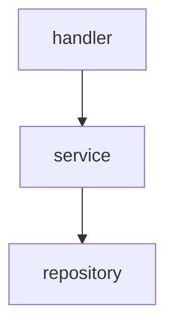

# Refactor Code Navigator to Markdown Format

## 任务概述

根据用户反馈，将 `code-navigator` 的 5 个 YAML 索引文件重构为 Markdown 格式（带 YAML frontmatter）。

## 完成内容

- ✅ 删除 5 个原有的 `.yaml` 文件
- ✅ 创建 5 个新的 `.md` 索引文件（带 YAML frontmatter）
- ✅ 更新 `SKILL.md` 和 `README.md` 中的所有引用

### 重构的索引文件

1. **structure.md**（原 structure.yaml）
   - 项目完整目录结构
   - Markdown 表格和代码块展示
   - 更清晰的层级关系

2. **modules.md**（原 modules.yaml）
   - 模块划分说明
   - 使用 Mermaid 图表可视化
   - 更易读的模块职责描述

3. **dependencies.md**（原 dependencies.yaml）
   - 依赖关系详细说明
   - Mermaid 依赖图谱
   - 表格化的依赖清单

4. **layers.md**（原 layers.yaml）
   - 分层架构详细说明
   - 每层的职责边界和最佳实践
   - 代码示例和反例对比

5. **development-paths.md**（原 development-paths.yaml）
   - 9 个开发场景的完整步骤
   - Markdown 格式更易阅读
   - 包含代码示例

## 关键文件

- `.agent/skills/code-navigator/SKILL.md` - 已更新所有引用
- `.agent/skills/code-navigator/indices/structure.md`
- `.agent/skills/code-navigator/indices/modules.md`
- `.agent/skills/code-navigator/indices/dependencies.md`
- `.agent/skills/code-navigator/indices/layers.md`
- `.agent/skills/code-navigator/indices/development-paths.md`

## 改进优势

### YAML 格式 vs Markdown 格式

| 特性         | YAML                | Markdown（当前）      |
| ------------ | ------------------- | --------------------- |
| **可读性**   | ❌ 数据结构，不直观 | ✅ 富文本，易读       |
| **格式化**   | ❌ 纯数据           | ✅ 标题、表格、代码块 |
| **可视化**   | ❌ 不支持           | ✅ Mermaid 图表       |
| **编辑体验** | ❌ 严格语法         | ✅ 灵活友好           |
| **代码示例** | ❌ 需要转义         | ✅ 原生支持           |

### Markdown + YAML Frontmatter 的优势

✅ **保留结构化元信息**：

```yaml
---
name: module-index
description: 简短描述
updated: 2026-01-19
---
```

✅ **富文本内容**：

- 标题层级
- 表格
- 代码块
- 列表
- Mermaid 图表

✅ **更好的文档体验**：

- 在编辑器中有语法高亮
- 支持 Markdown 预览
- 更易于编辑和维护

## 示例对比

### 旧格式（YAML）

```yaml
modules:
  - name: handler
    path: internal/handler
    layer: presentation
    responsibility: HTTP 请求处理
    dependencies:
      - internal/service
      - pkg/logger
```

### 新格式（Markdown + YAML frontmatter）

```markdown
---
name: modules-index
description: 模块划分和职责索引
updated: 2026-01-19
---

# 模块划分索引

## 核心业务模块

### handler - HTTP 处理器

**路径**：`internal/handler`  
**层级**：Presentation  
**职责**：HTTP 请求处理，参数验证，响应封装

**依赖**：

- `internal/service` - 调用业务逻辑
- `pkg/logger` - 日志记录
```

✅ Markdown 格式更清晰、更易读！

## 经验总结

### 1. 格式选择的权衡

- **纯 YAML**：适合程序化处理
- **Markdown + YAML frontmatter**：适合人类阅读和编辑
- **结论**：文档类索引应该优先考虑可读性

### 2. YAML frontmatter 的价值

- 保留了结构化元信息（name, description, updated）
- 同时支持富文本内容
- 兼顾了两者的优势

### 3. Mermaid 图表的重要性

在 Markdown 中可以直接使用 Mermaid：



这在 YAML 中无法原生支持。

---

**Git Commit Message**:

```
refactor(code-navigator): convert YAML indices to Markdown format

Changed 5 index files from .yaml to .md format:
- structure.yaml → structure.md
- modules.yaml → modules.md
- dependencies.yaml → dependencies.md
- layers.yaml → layers.md
- development-paths.yaml → development-paths.md

Benefits:
- Better readability with Markdown formatting
- Support for Mermaid diagrams
- Rich text with tables, code blocks, and headings
- Still retain YAML frontmatter for metadata

See docs/worklogs/2026/01/19_refactor_code_navigator_format.md
```
